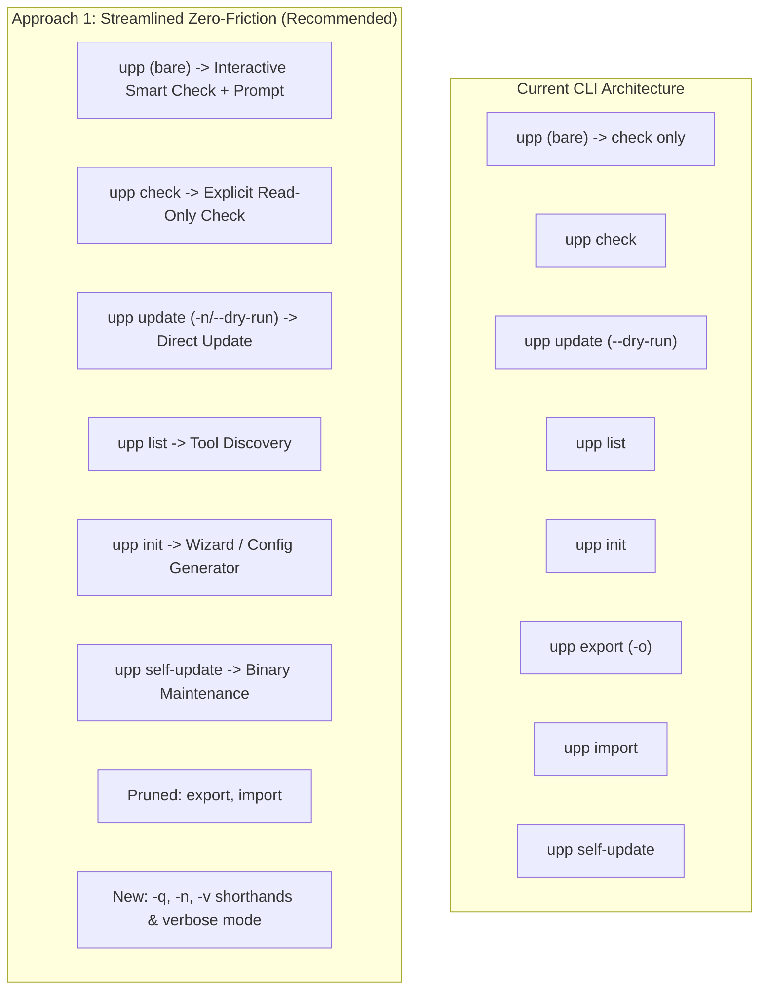

# Exploration: upp CLI Simplification & Subcommand/Flag Pruning

**Change ID**: `2026-08-19-upp-cli-simplification`  
**Date**: 2026-08-19  
**Sub-Agent**: `sdd-explore`  
**Status**: Completed  

---

## 1. Executive Summary

This exploration evaluates the simplification, restructuring, and pruning of subcommands and flags across the `upp` CLI to deliver an intuitive, zero-friction developer experience.

Key Findings:
1. **Dead Weight in Subcommands**: `upp export` and `upp import` add cognitive load and maintenance burden while duplicating standard file operations (`cat`/`cp` on `~/.config/upp/config.toml`). Modern developers manage configurations via dotfiles repositories, not bespoke CLI serialization commands.
2. **Friction in Bare `upp`**: Currently, bare `upp` is an alias for `upp check` (read-only status). While safe, it introduces a redundant two-step workflow (`upp` → see updates → `upp update`). An interactive "Check-and-Prompt" model in TTY environments creates a seamless single-command daily flow (`upp` → checks → `Apply 3 updates? [Y/n]`), while retaining `upp check` as the explicit non-interactive read-only command.
3. **Flag Ergonomics & Gaps**: Essential flags lack standard single-letter shorthands (e.g. `-q` for `--quiet`, `-n` for `--dry-run`). Furthermore, diagnostic capabilities are limited when adapters fail due to the absence of a `--verbose` / `-v` flag.
4. **Clean Grouping**: Pruning `export`/`import` eliminates the redundant "Config Commands" help group, reducing the help menu to a clean, cohesive structure.

---

## 2. Comprehensive CLI Subcommand Audit

The current command tree registered in `internal/cli/parser.go` contains 7 subcommands across 3 help groups, plus the root `upp` invocation:

| Subcommand | Group | Purpose | Interactive | Modifies System | Assessment |
|---|---|---|---|---|---|
| `upp` (bare) | *Root* | Query updates (currently identical to `check`) | No | No | **Opportunity**: Two-step friction. Can become smart interactive "check-then-prompt". |
| `upp check` | Tool Commands | Query enabled tools for available updates | No | No | **Keep**: Essential explicit read-only query for scripts, cron, CI, and inspection. |
| `upp update` | Tool Commands | Apply updates to enabled tools | Yes (prompts on untrusted/risk) | Yes | **Keep**: Core action command; accepts `--dry-run`. |
| `upp list` | Tool Commands | Table of detected tools, installation status, versions, and filter IDs | No | No | **Keep**: Indispensable discovery mechanism for `--only`/`--skip` IDs. |
| `upp init` | Config Commands | Scan tools and generate `~/.config/upp/config.toml` | Yes (if config exists) | Yes (writes file) | **Keep**: Essential for users wanting explicit config/pinning, despite zero-config defaults. |
| `upp export` | Config Commands | Print TOML config to stdout or file (`-o`) | No | No | **Prune (Dead Weight)**: Trivial wrapper over reading `config.toml`. |
| `upp import` | Config Commands | Replace `config.toml` from a file | Yes (confirm prompt) | Yes (replaces file) | **Prune (Dead Weight)**: Trivial wrapper over writing `config.toml`. Dotfiles tools handle this better. |
| `upp self-update` | Maintenance | Download release, verify sha256 checksum, atomically replace binary | Yes (confirm prompt) | Yes (replaces binary) | **Keep**: Crucial for binary distribution; isolated under Maintenance. |

### Deep Dive: `upp export` and `upp import`
- **Current Implementation**:
  - `internal/cli/export.go` (45 lines) calls `config.Export` / `config.ExportToFile` (`internal/config/export.go`).
  - `internal/cli/import.go` (50 lines) calls `config.ImportFromFile`, prompts confirmation, and calls `config.Save`.
- **Friction Analysis**:
  - Config location is standardized (`~/.config/upp/config.toml` on Linux/macOS, `%APPDATA%/upp/config.toml` on Windows).
  - Modern developers version control dotfiles or edit TOML files directly in their editor.
  - Having top-level commands `upp export` and `upp import` clutters `upp --help` and imposes ongoing test/spec overhead without providing real value over standard shell operations.
  - **Verdict**: Remove `export` and `import` from the CLI.

### Deep Dive: Bare `upp` UX
- **Current Behavior**: `upp` executes `runCheck(gf, version, checkDeps{})`.
- **Friction Analysis**:
  - Developers type `upp` expecting an update tool to update their environment.
  - When `upp` only prints `⬆️ 3 available`, the developer is forced to re-run `upp update`.
  - Conversely, blindly running updates without previewing what will change can be jarring.
- **Smart Check-and-Prompt Workflow (Proposed)**:
  - In an interactive terminal (**TTY**):
    1. Run concurrent check across all enabled tools.
    2. Render the check summary report.
    3. If **0 updates available** (or all skipped) → Exit 0 immediately.
    4. If **updates are available** → Display prompt: `Apply updates now? [Y/n]` (defaulting to Yes).
    5. If confirmed (`Y`/`Enter`) → Immediately proceed with `runUpdate` (applying updates).
    6. If declined (`n`) → Exit 0 cleanly without changes.
  - In **non-interactive** environments (piped stdout/stdin, dumb terminal, or `--ci`):
    - Bare `upp` behaves strictly as `check` (read-only, zero prompts, deterministic exit code).
  - `upp check` remains the guaranteed 100% read-only command in all contexts.
  - `upp update` remains the direct action command (proceeds immediately to update execution).

---

## 3. Flag Audit & Ergonomics

### Current Flags vs Proposed Adjustments

| Flag | Scope | Current Shorthand | Proposed Shorthand | Assessment & Recommendations |
|---|---|---|---|---|
| `--quiet` | Root (Persistent) | *None* | `-q` | Add `-q`. Standard POSIX convention; reduces noise in scripts. |
| `--ci` | Root (Persistent) | *None* | *None* | Keep explicit `--ci`. Non-interactive safety gate. |
| `--only <tools>` | Root (Persistent) | *None* | *None* | Keep explicit `--only`. Comma-separated filtering. |
| `--skip <tools>` | Root (Persistent) | *None* | *None* | Keep explicit `--skip`. Comma-separated exclusion. |
| `--dry-run` | `update` command | *None* | `-n` | Add `-n`. Standard shorthand for preview/dry-run across CLI tools (`make`, `rsync`, etc.). |
| `--verbose` | *Not implemented* | *None* | `-v` | **Add Root Flag**: When adapters fail (e.g. `brew update` exit 1), `--verbose` / `-v` streams or displays full subprocess output/stderr for troubleshooting. |
| `-o, --output` | `export` command | `-o` | *N/A* | Pruned along with `export`. |
| `--config <path>` | *Not implemented* | *None* | *Omit / Defer* | YAGNI for v1. Standard `~/.config/upp/config.toml` path is sufficient; environment variable `UPP_CONFIG` can be considered if needed later. |
| `--json` | *Not implemented* | *None* | *Defer* | YAGNI for current scope. `check` and `list` output formats can be extended with JSON in a future machine-interface change. |
| `--parallel <N>` | *Not implemented* | *None* | *Omit* | Automatic clamping to `[4..8]` worker threads (`calculateWorkerCount`) works reliably without requiring manual tuning. |

---

## 4. Architectural Approaches & Tradeoffs

### Approach Matrix

| Dimension | Approach 1: Streamlined Zero-Friction (Recommended) | Approach 2: Conservative Pruning | Approach 3: Radical Single-Command Merge |
|---|---|---|---|
| **Subcommands** | 5 subcommands (`init`, `list`, `check`, `update`, `self-update`) + bare `upp` | 5 subcommands + bare `upp` | 3 subcommands (`list`, `init`, `self-update`) + bare `upp` (merges check & update) |
| **Bare `upp` Behavior** | Smart Check-and-Prompt in TTY; pure check in non-TTY/CI | Strictly alias of `check` (read-only) | Full update immediately |
| **`export` / `import`** | Pruned completely | Pruned completely | Pruned completely |
| **Flag Enhancements** | `-q`, `-n`, `-v` (`--verbose`) | `-q`, `-n` only | `-n`, `-v`, `--check` |
| **Developer Friction** | **Zero**: 1 command (`upp`) handles 90% of daily use | **Medium**: Still requires 2 commands (`upp` then `upp update`) | **High**: Eliminates explicit `check` command; unexpected side effects |
| **Blast Radius** | Low–Medium (prunes unused commands, updates tests) | Low (pure deletion of export/import) | High (removes `check` and `update` subcommands) |

---

## 5. Blast Radius & Affected Specs

### A. Canonical OpenSpec Updates
1. `openspec/specs/command-interface/spec.md`:
   - **Requirement: Command Structure**:
     - Remove `export` and `import` rows from the command table and scenarios.
     - Update bare `upp` description: interactive TTY check-and-prompt, non-interactive read-only check.
     - Clarify active command set: `init`, `list`, `check`, `update`, `self-update`.
   - **Requirement: Global Flags**:
     - Add `-q, --quiet` and `-v, --verbose`.
   - **Requirement: `upp update`**:
     - Add `-n, --dry-run`.
   - **Requirement: Help Output Grouping**:
     - Remove "Config Commands" group. Group commands into "Commands" (`check`, `list`, `update`, `init`) and "Maintenance" (`self-update`).
   - **Remove Requirement: `upp export` / `upp import`**.

2. `openspec/specs/config-system/spec.md`:
   - **Remove Requirement: Export/Import**.
   - Update config file location and formatting specifications to note standard filesystem management.

3. `openspec/specs/ux-patterns/spec.md`:
   - **Add Requirement: Smart Check-and-Prompt**:
     - Detail the TTY prompt flow for bare `upp`: Check runs -> If updates available -> Prompt `Apply updates now? [Y/n]` -> Execute update or cancel.
     - Ensure `--quiet` and non-TTY bypass prompt and act as read-only.
   - **Add Requirement: Verbose Output**:
     - Specify `--verbose` / `-v` behavior for emitting subprocess details during failures.

### B. Codebase Modifications
- `internal/cli/export.go`: Remove file.
- `internal/cli/import.go`: Remove file.
- `internal/config/export.go`: Remove file (or retain only minimal internal helpers if needed, otherwise delete).
- `internal/cli/parser.go`:
  - Update `BuildRoot()` for persistent flags (`-q`, `-v`).
  - Wire bare `upp` `RunE` to smart check-and-prompt runner.
  - Update `AddCommands()` to remove `export`, `import`, and simplify groups.
- `internal/cli/update.go`: Add `-n` shorthand for `--dry-run`.
- `internal/cli/check.go`: Support verbose error details if requested.
- `internal/output/render.go`: Add smart prompt rendering helper if needed.
- `cmd/upp/main.go`: Unchanged (standard entrypoint).
- `README.md`: Update command reference, flags table, and quickstart documentation.
- `Makefile` & test suites: Update test cases in `internal/cli/*_test.go` and `internal/config/*_test.go` to remove export/import tests and add test coverage for smart bare `upp` and shorthand flags.

---

## 6. Implementation Strategy & Slicing

To maintain clean reviews and strict test coverage, the change can be structured into 2 targeted slices:

### Slice 1: Subcommand Pruning & Flag Ergonomics
- Delete `export.go` and `import.go` from `internal/cli/` and `internal/config/export.go`.
- Remove `export` and `import` command registrations and tests.
- Simplify cobra CommandGroups in `parser.go`.
- Add flag shorthands: `-q` for `--quiet`, `-n` for `--dry-run`.
- Add `--verbose` / `-v` flag scaffolding.
- Update `command-interface` and `config-system` specs.

### Slice 2: Smart Bare `upp` Workflow & Verbose Diagnostics
- Implement interactive Smart Check-and-Prompt in `internal/cli/` for bare `upp`.
- Ensure non-TTY, pipe, and `--ci` invocations remain strictly read-only.
- Implement verbose subprocess diagnostic output for failing adapters under `-v` / `--verbose`.
- Update `ux-patterns` spec and README.md.
- Comprehensive integration and hermetic CLI test suite updates.

---

## 7. Recommendation

Proceed with **Approach 1 (Streamlined Zero-Friction)**:
1. **Prune `upp export` and `upp import`**: Eliminate unnecessary complexity.
2. **Elevate bare `upp` to Smart Check-and-Prompt**: Turn `upp` into the single command most users ever need for day-to-day maintenance.
3. **Preserve `upp check` & `upp update`**: Keep explicit commands for automation, CI/CD, and precise user intent.
4. **Add standard shorthands (`-q`, `-n`, `-v`)**: Align with Unix CLI conventions and improve debugging with `--verbose`.
