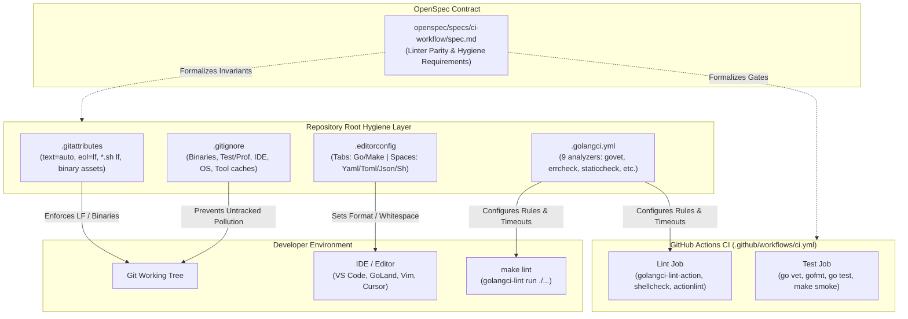
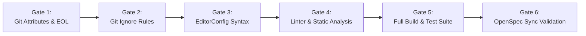

# Technical Design: Repository Hygiene, Tooling Configuration & Cross-Platform Parity

**Change ID**: `2026-08-18-upp-repo-hygiene`  
**Date**: 2026-08-18  
**Domain**: Repository Hygiene, Cross-Platform Stability, Tooling Parity, CI/CD Standards  
**Status**: Ready for Tasks  

---

## 1. Executive Summary & Goals

### 1.1 Overview
`upp` is a compiled cross-platform CLI tool targeting Linux (`amd64`, `arm64`), macOS (`amd64`, `arm64`), and Windows (`amd64`). The repository currently lacks comprehensive repository-level hygiene configurations:
1. `.gitignore` only contains 6 lines, leaving Windows binaries (`upp.exe`), Go profiling/test dumps (`*.prof`, `coverage.html`), IDE files (`.idea/`, `.vscode/`), and OS clutter (`.DS_Store`, `Thumbs.db`) untracked and vulnerable to inadvertent check-in.
2. Missing `.gitattributes` allows Git on Windows to check out shell scripts (`scripts/*.sh`) with CRLF line endings, triggering instant execution failure (`\r: command not found`) in POSIX, WSL, and CI environments.
3. Missing `.editorconfig` leads to inconsistent indentation (tabs for Go/Make vs. spaces for configs/shell) across contributor IDEs.
4. Missing `.golangci.yml` creates linter drift between local developer environments and CI runs.
5. Living specifications in `openspec/specs/ci-workflow/spec.md` lack formal requirements for repository hygiene and linter parity.

This technical design document details the concrete configurations, architectural choices, threat mitigations, and strict verification strategy to establish a rock-solid hygiene foundation.

### 1.2 In-Scope Goals
- **Hermetic Working Tree**: Expand `.gitignore` into 5 logical categories (Binaries, Go Test/Prof, IDEs, OS metadata, Tool caches).
- **Line-Ending Normalization**: Establish `.gitattributes` enforcing `* text=auto eol=lf`, `*.sh text eol=lf`, and explicit binary file types.
- **Cross-Editor Alignment**: Implement `.editorconfig` enforcing tab indentation for Go/Makefiles, 2-space indentation for YAML/TOML/JSON/Shell, and preserving Markdown trailing whitespace.
- **Deterministic Go Linting**: Implement canonical `.golangci.yml` enabling 9 verified clean linters with tuned analyzer settings.
- **OpenSpec Formalization**: Update `openspec/specs/ci-workflow/spec.md` with RFC 2119 requirements for linter parity and repository hygiene.

### 1.3 Non-Goals
- Adding external multi-language hook runners (e.g. Python `pre-commit`).
- Enabling noisy/invasive linters (e.g. strict `revive` or `gosec`) that flag idiomatic Cobra CLI callbacks or test fixtures.
- Modifying core application runtime code or release asset compilation scripts.

---

## 2. Technical Architecture & Component Interaction



### Component Roles:
- **`.gitattributes`**: Directly controls Git's line-ending conversion and binary filtering, preventing CRLF execution crashes.
- **`.gitignore`**: Defines exclusionary filters to keep `git status` clean after builds, test runs, and editor operations.
- **`.editorconfig`**: Bridges editor settings across disparate developer tools without requiring bespoke IDE plugins.
- **`.golangci.yml`**: Locks down analyzer behavior, timeouts, and issue reporting identically for `make lint` and CI `golangci-lint-action`.
- **OpenSpec**: Formalizes these invariants as specification requirements and verifiable GIVEN-WHEN-THEN scenarios.

---

## 3. Architectural Decisions

### Decision 1: Comprehensive Hygiene Standard vs. Minimalist Addition
- **Choice**: Comprehensive Repository Hygiene & Cross-Platform Parity Standard (Approach 2 from exploration).
- **Alternatives Considered**:
  1. *Minimalist additions (Approach 1)*: Adding 2-3 lines to `.gitignore` and a 1-line `.gitattributes`. Rejected because it leaves common IDE folders, test dumps, and binary extensions unhandled.
  2. *Strict multi-tool framework (Approach 3)*: Introducing Python `pre-commit` and 30+ linters. Rejected due to external runtime dependencies and high developer friction.
- **Rationale**: The comprehensive approach resolves all cross-platform vulnerabilities with zero external dependencies and zero false positives.

### Decision 2: Universal Line Ending Normalization Strategy
- **Choice**: Global `* text=auto eol=lf` with explicit `*.sh text eol=lf`, `*.go text eol=lf`, config extensions, and binary definitions.
- **Alternatives Considered**:
  - Relying on developer-configured `core.autocrlf`.
  - Setting `* text eol=lf` without `auto` detection.
- **Rationale**: Relying on local Git configs is error-prone. Explicitly configuring `* text=auto eol=lf` ensures Git handles line endings consistently across Windows, macOS, and Linux checkouts while preventing binary corruption.

### Decision 3: Go Linter Suite Selection & Exclusion Tuning
- **Choice**: Explicitly enable 9 verified clean linters:
  1. `govet` (standard Go vet analyzers; `fieldalignment` disabled to prevent non-critical struct churn)
  2. `errcheck` (flags unhandled errors; `check-type-assertions: true` enabled)
  3. `staticcheck` (advanced static analysis)
  4. `unused` (detects unused constants, variables, functions, and types)
  5. `gosimple` (Go code simplification)
  6. `ineffassign` (detects ineffectual variable assignments)
  7. `gofmt` (verifies formatting with `simplify: true`)
  8. `unconvert` (detects redundant type conversions)
  9. `misspell` (typo detection under US locale)
- **Linters Excluded & Rationale**:
  - `revive`: Flags standard Cobra callback signatures `RunE: func(cmd *cobra.Command, args []string) error` for unused `cmd` parameter.
  - `gosec`: Flags standard test file creation permissions (`0644` vs `0600`) and test subshell executions.
- **Rationale**: 100% signal, 0% noise. Ensures deterministic CI passes without cluttering production code with `//nolint` annotations.

### Decision 4: EditorConfig Rules & Markdown Trailing Whitespace Exception
- **Choice**:
  - Tabs (size 4) for `[*.go]` and `[Makefile]`.
  - 2 spaces for `[*.{yml,yaml,toml,json}]` and `[*.sh]`.
  - `trim_trailing_whitespace = false` specifically for `[*.md]`.
- **Alternatives Considered**: Global `trim_trailing_whitespace = true` applied indiscriminately.
- **Rationale**: Markdown standard uses two trailing spaces to denote a hard line break (`<br>`). Global whitespace trimming destroys these intentional line breaks.

---

## 4. Concrete File Specifications

### 4.1 `.gitignore` Layout
The updated `.gitignore` MUST be organized into 5 clear logical sections:

```gitignore
# Binaries and build outputs
upp
upp.exe
dist/
bin/
*.exe
*.exe~
*.dll
*.so
*.dylib

# Go test, coverage, and profiling artifacts
*.test
*.out
*.prof
*.pprof
coverage.out
coverage.html
coverage.txt
cpu.out
mem.out
trace.out

# IDE and editor files
.idea/
*.iml
*.iws
.vscode/
*.code-workspace
*.swp
*.swo
*~
#*#
.#*

# Operating system metadata
.DS_Store
.DS_Store?
._*
.Spotlight-V100
.Traces
Thumbs.db
ehthumbs.db
Desktop.ini

# Local AI and tool runtime state
.atl/
.codegraph/
.gemini/
```

### 4.2 `.gitattributes` Layout
The `.gitattributes` file MUST be placed in the repository root:

```gitattributes
# Default text handling with LF line endings
* text=auto eol=lf

# Force LF on shell scripts (critical for Linux/CI execution on Windows checkouts)
*.sh text eol=lf

# Go source code
*.go text eol=lf

# Configuration and documentation files
*.yml text eol=lf
*.yaml text eol=lf
*.toml text eol=lf
*.json text eol=lf
*.md text eol=lf

# Binary files
*.png binary
*.jpg binary
*.jpeg binary
*.gif binary
*.ico binary
*.tar.gz binary
*.zip binary
*.exe binary
```

### 4.3 `.editorconfig` Layout
The `.editorconfig` file MUST be placed in the repository root:

```ini
root = true

[*]
charset = utf-8
end_of_line = lf
insert_final_newline = true
trim_trailing_whitespace = true

[*.go]
indent_style = tab
indent_size = 4

[Makefile]
indent_style = tab
indent_size = 4

[*.{yml,yaml,toml,json}]
indent_style = space
indent_size = 2

[*.sh]
indent_style = space
indent_size = 2

[*.md]
indent_style = space
indent_size = 2
trim_trailing_whitespace = false
```

### 4.4 `.golangci.yml` Layout
The `.golangci.yml` configuration MUST be placed in the repository root:

```yaml
run:
  timeout: 5m
  modules-download-mode: readonly
  tests: true

linters:
  disable-all: true
  enable:
    - govet
    - errcheck
    - staticcheck
    - unused
    - gosimple
    - ineffassign
    - gofmt
    - unconvert
    - misspell

linters-settings:
  errcheck:
    check-type-assertions: true
    check-blank: false
  govet:
    disable:
      - fieldalignment
  misspell:
    locale: US
  gofmt:
    simplify: true

issues:
  max-issues-per-linter: 0
  max-same-issues: 0
```

### 4.5 `Makefile` Verification
The existing `Makefile` contains:
```makefile
## lint: run golangci-lint (if installed)
lint:
	@if command -v golangci-lint >/dev/null 2>&1; then \
		golangci-lint run ./...; \
	else \
		echo "golangci-lint not installed, using go vet"; \
		$(MAKE) vet; \
	fi
```
This target already passes `./...` to `golangci-lint run`, which automatically discovers and respects `.golangci.yml` in the root directory. No breaking changes needed.

### 4.6 `openspec/specs/ci-workflow/spec.md` Delta
The living specification will be updated with:
- **`Requirement: Go Linter Configuration and Local Parity`**: Mandates `.golangci.yml` with 5m timeout, readonly modules, test scanning, 9 enabled linters, type assertion checking, and unlimited issue reporting.
- **`Requirement: Repository Hygiene and Line Ending Normalization`**: Mandates `.gitignore` (5 categories), `.gitattributes` (`eol=lf`, script LF enforcement, binary rules), and `.editorconfig` (tab vs. 2-space indentation, Markdown whitespace retention).

---

## 5. Threat & Edge Case Matrix

| ID | Threat / Edge Case | Risk | Mitigation Strategy |
|---|---|---|---|
| **T1** | **CRLF in Shell Scripts on Windows**<br>Windows git checkout converts `scripts/*.sh` to CRLF; execution in WSL/Linux/CI fails with `\r: command not found`. | High | `.gitattributes` mandates `*.sh text eol=lf`, forcing Git to check out shell scripts with LF line endings regardless of local `core.autocrlf`. |
| **T2** | **Accidental Binary / Test Artifact Commit**<br>Running `make build-all` or `go test -coverprofile=coverage.html` creates untracked `upp.exe`, `.prof`, or `.html` files that could be accidentally committed. | Med | `.gitignore` explicitly covers all platform binary extensions (`upp`, `upp.exe`, `*.exe`, `*.dll`, `*.so`, `*.dylib`) and test/profiling dumps (`*.test`, `*.prof`, `*.pprof`, `coverage.*`, `cpu.out`, `mem.out`, `trace.out`). |
| **T3** | **Linter False Positive Noise**<br>Aggressive linters (`revive`, `gosec`) flagging standard Cobra `RunE` callback signatures or test fixtures, creating contributor friction. | Med | Selective linter activation in `.golangci.yml` (`disable-all: true`, enabling 9 clean linters: `govet`, `errcheck`, `staticcheck`, `unused`, `gosimple`, `ineffassign`, `gofmt`, `unconvert`, `misspell`) with `fieldalignment` disabled. |
| **T4** | **Markdown Hard Line Break Trimming**<br>EditorConfig automatically strips trailing 2 spaces from Markdown files, destroying intentional `<br>` formatting in docs. | Low | Explicit `.editorconfig` section `[*.md]` sets `trim_trailing_whitespace = false`. |
| **T5** | **Binary Asset Corruption via Git EOL Conversion**<br>Binary files (archives, images, binaries) mangled by text normalization. | High | Explicit `.gitattributes` binary pattern rules (`*.png binary`, `*.jpg binary`, `*.tar.gz binary`, `*.zip binary`, `*.exe binary`). |
| **T6** | **Specification Drift**<br>Changes implemented in repository without updating living OpenSpec specifications. | Med | Spec delta `openspec/changes/2026-08-18-upp-repo-hygiene/specs/ci-workflow/spec.md` prepared and synchronized into `openspec/specs/ci-workflow/spec.md`. |

---

## 6. Verification & Strict TDD Strategy

During the apply phase, all changes will be verified across 6 sequential verification gates:



### Gate 1: Git Attributes & Line Ending Verification
- Run `git check-attr -a scripts/install.sh scripts/smoke-test.sh scripts/publish-release.sh` — confirm `eol: lf` and `text: set`.
- Run `git check-attr -a cmd/upp/main.go internal/config/config.go` — confirm `eol: lf` and `text: set`.
- Run `git check-attr -a dist/upp-linux-amd64.tar.gz dist/upp.exe` — confirm `binary: set`.
- Verify script line endings via `file scripts/*.sh` (must be ASCII text / UTF-8 text with standard LF terminators, no CRLF).

### Gate 2: Git Ignore Rules Verification
Test ignore patterns using `git check-ignore -v <path>` for samples from each category:
- Binaries: `git check-ignore -v upp upp.exe dist/test bin/app.exe app.dll app.so app.dylib`
- Test & Profiling: `git check-ignore -v pkg.test coverage.out coverage.html coverage.txt cpu.out mem.out trace.out test.prof test.pprof`
- IDE & Editors: `git check-ignore -v .idea/workspace.xml app.iml app.iws .vscode/settings.json proj.code-workspace file.swp file.swo file~ #file# .#file`
- OS Metadata: `git check-ignore -v .DS_Store .DS_Store? ._test .Spotlight-V100 .Traces Thumbs.db ehthumbs.db Desktop.ini`
- Tool Caches: `git check-ignore -v .atl/state .codegraph/index .gemini/session`

### Gate 3: EditorConfig Validation
- Verify `.editorconfig` syntax and indentation rule mapping across Go, Makefile, YAML, TOML, JSON, Shell, and Markdown.

### Gate 4: Go Linter & Static Analysis
- Run `go vet ./...` — must pass with 0 errors.
- Run `test -z "$(gofmt -s -l .)"` — must pass (0 unformatted files).
- Run `golangci-lint run ./...` (or via `go run github.com/golangci/golangci-lint/cmd/golangci-lint@v1.64.5 run ./...`) against `.golangci.yml` — must exit 0 with 0 issues reported.
- Run `actionlint .github/workflows/ci.yml` — must pass.

### Gate 5: Build, Test & Smoke Suite
- Run `go test ./... -count=1 -race` — all unit and race tests pass.
- Run `make build` and `make smoke` — build succeeds and smoke tests pass.

### Gate 6: OpenSpec Synchronization
- Verify delta spec in `openspec/changes/2026-08-18-upp-repo-hygiene/specs/ci-workflow/spec.md` matches living spec additions in `openspec/specs/ci-workflow/spec.md`.

---

## 7. Next Steps
Proceed to Task Breakdown (`/sdd-tasks`) to create `openspec/changes/2026-08-18-upp-repo-hygiene/tasks.md`.
