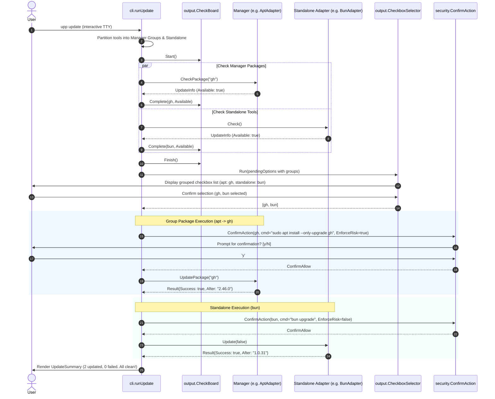
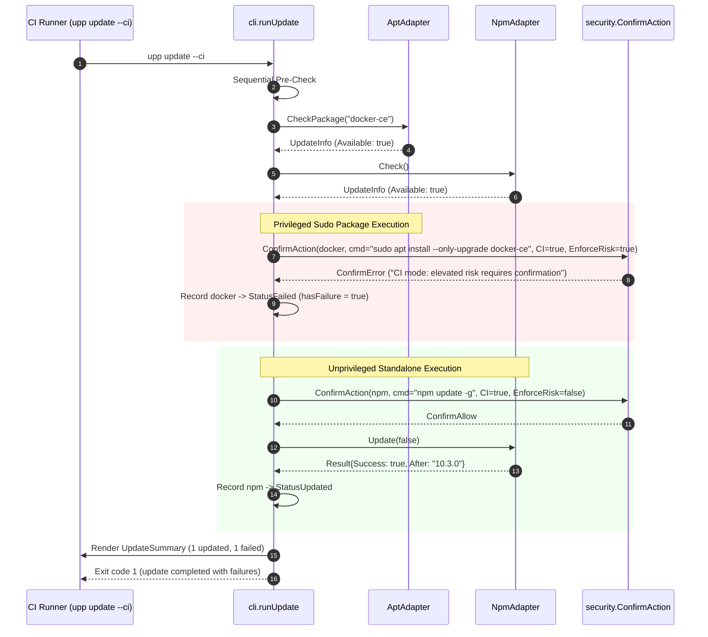
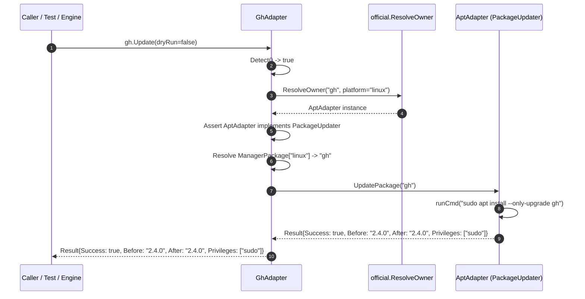

# Technical Design: Default Manager-Group Bulk Updates (`upp-bulk-upgrade-default`)

## Executive Summary

Previously, owned tools ([`gh`](file:///home/jhan/projects/upp/internal/adapters/official/gh.go), [`docker`](file:///home/jhan/projects/upp/internal/adapters/official/docker.go), [`go`](file:///home/jhan/projects/upp/internal/adapters/official/go.go)) delegated `Update()` to their manager's self-only update (`apt`, `brew update`, `winget upgrade winget`), which upgraded the manager itself rather than the managed packages. Upgrading owned packages required users to explicitly opt into `--manager <mgr>` or `--update-group <mgr>`.

This change makes manager-group bulk package updates the **default execution mode** in standard `upp update` invocations:
1. Owned tools (`gh`, `docker`, `go`) delegate `Update()` directly to [`PackageUpdater.UpdatePackage(pkg)`](file:///home/jhan/projects/upp/internal/adapters/interface.go#L86-L90) using platform-resolved package names.
2. The CLI update engine executes manager-group bulk package updates for all resolved manager groups containing enabled owned tools by default, alongside standalone tool adapters.
3. Sudo elevation risk is strictly enforced via `EnforceRisk: true`, prompting in interactive TTY sessions and failing closed non-zero in `--ci` mode.
4. Failures are isolated per tool so that a failing package update does not halt sibling packages or standalone tools.
5. Interactive TTY [`CheckboxSelector`](file:///home/jhan/projects/upp/internal/output/selector.go) supports granular per-tool toggling within manager groups.

---

## Key Architecture Decisions & Tradeoffs

```
+-----------------------------------------------------------------------------------------+
|                                    upp update Flow                                      |
+-----------------------------------------------------------------------------------------+
                                             |
                                             v
                      +---------------------------------------------+
                      |   Partition Enabled & Filtered Adapters     |
                      +---------------------------------------------+
                                     /               \
                                    /                 \
                                   v                   v
      +---------------------------------------+   +------------------------------------+
      |            Manager Groups             |   |          Standalone Tools          |
      | (e.g. apt owning gh, docker-ce)       |   | (e.g. bun, npm, nvm, go on Linux)  |
      +---------------------------------------+   +------------------------------------+
                          |                                         |
                          v                                         v
      +---------------------------------------+   +------------------------------------+
      | CheckPackage(pkg) via PackageChecker  |   |    Check() via standard Adapter    |
      +---------------------------------------+   +------------------------------------+
                          |                                         |
                          +-------------------+---------------------+
                                              |
                                              v
                              +-------------------------------+
                              |    Interactive TTY Selector   |
                              |  (Granular per-tool toggling) |
                              +-------------------------------+
                                              |
                                              v
                               +-----------------------------+
                               |     Execution & Safety      |
                               +-----------------------------+
                               /                             \
                              /                               \
                             v                                 v
   +---------------------------------------+   +------------------------------------+
   |     Manager Package Execution         |   |    Standalone Tool Execution       |
   | - EnforceRisk: true                   |   | - ConfirmAction (Trust/Risk)       |
   | - TTY: Prompt if sudo                 |   | - Adapter.Update(dryRun)           |
   | - CI: Fail closed if unconfirmed      |   | - Error isolation per tool         |
   | - UpdatePackage(pkg) via PackageUpdater|  +------------------------------------+
   | - Error isolation per package         |
   +---------------------------------------+
```

### D1: Two-Layer Delegation (`Adapter.Update()` vs CLI Runner)

- **Context**: Owned tools can be invoked in two ways: (1) directly via `adapter.Update(dryRun)` (such as direct library callers or fallback sequential execution), or (2) orchestrated via `internal/cli/update.go` default manager grouping.
- **Decision**: Implement delegation at **both** layers:
  1. **Adapter Layer**: Inside [`GhAdapter.Update`](file:///home/jhan/projects/upp/internal/adapters/official/gh.go#L49), [`DockerAdapter.Update`](file:///home/jhan/projects/upp/internal/adapters/official/docker.go#L48), and [`GoAdapter.Update`](file:///home/jhan/projects/upp/internal/adapters/official/go.go#L57), resolve the manager via [`official.ResolveOwner`](file:///home/jhan/projects/upp/internal/adapters/official/ownership.go#L14), assert `owner.(adapters.PackageUpdater)`, lookup the platform package name via `a.Info().ManagerPackage[platform]`, and call `updater.UpdatePackage(pkg)`. For tools with no resolving owner on the host platform (e.g., `go` on Linux), execute the standalone adapter update path.
  2. **CLI Runner Layer**: In [`internal/cli/update.go`](file:///home/jhan/projects/upp/internal/cli/update.go), partition active adapters into manager groups and standalone tools. Package availability is checked via [`PackageChecker.CheckPackage(pkg)`](file:///home/jhan/projects/upp/internal/adapters/interface.go#L73-L77), and execution invokes `UpdatePackage(pkg)` directly on the resolved manager.
- **Tradeoffs**:
  - *Pros*: Complete consistency and parity. Even if an adapter's `Update()` is invoked standalone outside the grouped runner, it correctly upgrades the package under its manager rather than triggering manager self-update.
  - *Cons*: Minor redundancy between adapter delegation and CLI orchestration, but eliminated by having both invoke the identical [`PackageUpdater.UpdatePackage`](file:///home/jhan/projects/upp/internal/adapters/interface.go#L86-L90) interface.

### D2: Default CLI Runner Group Execution Flow

- **Context**: Previously, `runUpdateGroup` was only invoked when `--manager <mgr>` or `--update-group <mgr>` was explicitly passed. Bare `upp update` called `runUpdateSequential` or `runUpdateInteractive` without manager grouping for package updates.
- **Decision**:
  1. Make manager-group package updates the default execution flow in `runUpdate`.
  2. Maintain `--manager <mgr>` and `--update-group <mgr>` as explicit filters that restrict processing to the specified manager group.
  3. Reorder candidate tools deterministically: Manager groups first in canonical order ([`official.AllAdapters`](file:///home/jhan/projects/upp/internal/adapters/official/registry.go)), followed by their owned tools, followed by standalone tools.
  4. Manager self-update rows (e.g., `apt`, `brew`, `winget`, `scoop`) remain distinct self-only rows and are never conflated with owned package updates.
- **Tradeoffs**:
  - *Pros*: Natural user experience where `upp update` upgrades all installed tools out of the box.
  - *Cons*: Requires coordinating group availability checks and standalone checks in both interactive and non-interactive update paths.

### D3: Sudo Risk Enforcement (`EnforceRisk: true`)

- **Context**: Manager package commands often require elevated privileges (e.g., `sudo apt install --only-upgrade <pkg>` or Linux `go` root tarball extraction). Official tools have `TrustOfficial`, which might bypass standard custom tool confirmation prompts unless elevated risk is explicitly enforced.
- **Decision**:
  - Pass `EnforceRisk: true` into [`security.ConfirmAction`](file:///home/jhan/projects/upp/internal/security/confirm.go) for all package updates and elevated commands.
  - In **Interactive TTY**: Display a security prompt before executing privileged commands requiring `sudo`.
  - In **CI Mode (`--ci`)**: Fail closed (`ConfirmError` / `StatusFailed`) immediately without prompting for password, record the tool failure, and exit non-zero at completion.
- **Tradeoffs**:
  - *Pros*: Prevents headless CI runs from hanging indefinitely on sudo prompts; ensures interactive users are informed before elevated mutations occur.
  - *Cons*: CI workflows requiring sudo must configure passwordless sudo or pre-authenticated credentials, but fail-closed is strictly required for headless safety.

### D4: Per-Tool Error Isolation

- **Context**: A package manager failure (e.g., `apt` lock held or repository unreachable for `gh`) must not abort the remaining tools in the manager group or standalone tools.
- **Decision**:
  - Encapsulate each package update in an individual execution boundary.
  - If `UpdatePackage(pkg)` or `Adapter.Update()` returns an error or failure result:
    1. Mark the individual tool as [`StatusFailed`](file:///home/jhan/projects/upp/internal/output/render.go#L22).
    2. Capture diagnostic stderr/error messages.
    3. Proceed to the next tool in canonical order.
  - In `--ci` mode, aggregate any failures and exit non-zero at the very end of the run.
- **Tradeoffs**:
  - *Pros*: Maximizes update completion across independent tools; provides actionable summary of failures.
  - *Cons*: A broken package manager may fail repeatedly across owned tools in that group, but each failure is isolated and reported clearly.

---

## Call Flow & Architecture Diagrams

### 1. Default Update Sequence (Interactive TTY Mode)



### 2. Default Update in CI Mode (`--ci`) with Elevated Risk Fail-Closed



### 3. Owned Tool Direct Delegation (`gh.Update()`)



---

## Implementation Seams & File Touchpoints

### 1. `internal/adapters/official/gh.go`
- **Method**: [`GhAdapter.Update(dryRun bool) (adapters.Result, error)`](file:///home/jhan/projects/upp/internal/adapters/official/gh.go#L49-L73)
- **Changes**:
  - Replace `owner.Update(dryRun)` with delegation to [`PackageUpdater.UpdatePackage(pkg)`](file:///home/jhan/projects/upp/internal/adapters/interface.go#L86-L90).
  - Handle `dryRun`: return safe `Result{Success: true}` before mutation.
  - Resolve platform via `runtimeGOOSToPlatform(runtime.GOOS)`.
  - Type-assert `owner.(adapters.PackageUpdater)`.
  - Look up package name `a.Info().ManagerPackage[platform]`.
  - Return `updater.UpdatePackage(pkg)`.

```go
func (a *GhAdapter) Update(dryRun bool) (adapters.Result, error) {
	if !a.Detect() {
		return adapters.Result{Success: false}, fmt.Errorf("gh is not installed")
	}

	platform := runtimeGOOSToPlatform(runtime.GOOS)
	if owner := ResolveOwner("gh", platform); owner != nil {
		if dryRun {
			return adapters.Result{Success: true}, nil
		}
		if updater, ok := owner.(adapters.PackageUpdater); ok {
			pkg := a.Info().ManagerPackage[platform]
			if pkg == "" {
				return adapters.Result{Success: false}, fmt.Errorf("gh has no manager package on %s", runtime.GOOS)
			}
			return updater.UpdatePackage(pkg)
		}
		return adapters.Result{Success: false}, fmt.Errorf("gh's manager %s does not support per-package updates", runtime.GOOS)
	}

	return adapters.Result{
		Success: false,
		Error:   fmt.Errorf("gh has no resolving owner on %s", runtime.GOOS),
	}, nil
}
```

### 2. `internal/adapters/official/docker.go`
- **Method**: [`DockerAdapter.Update(dryRun bool) (adapters.Result, error)`](file:///home/jhan/projects/upp/internal/adapters/official/docker.go#L48-L70)
- **Changes**:
  - Mirror the `GhAdapter.Update` implementation: resolve owner on `runtimeGOOSToPlatform(runtime.GOOS)`, assert `PackageUpdater`, lookup `ManagerPackage[platform]` (e.g. `docker-ce` on Linux, `docker` on macOS, `Docker.Docker` on Windows), and delegate to `updater.UpdatePackage(pkg)`.

### 3. `internal/adapters/official/go.go`
- **Method**: [`GoAdapter.Update(dryRun bool) (adapters.Result, error)`](file:///home/jhan/projects/upp/internal/adapters/official/go.go#L57-L128)
- **Changes**:
  - For platforms with a resolving owner (macOS `brew` -> `golang`, Windows `winget` -> `GoLang.Go`), assert `PackageUpdater` and delegate to `updater.UpdatePackage(pkg)`.
  - On Linux (`ResolveOwner` returns `nil`), retain the native standalone curl/tarball installation logic.

### 4. `internal/cli/update.go`
- **Functions**: [`runUpdate`](file:///home/jhan/projects/upp/internal/cli/update.go#L61), [`runUpdateSequential`](file:///home/jhan/projects/upp/internal/cli/update.go#L124), [`runUpdateInteractive`](file:///home/jhan/projects/upp/internal/cli/update.go#L302), [`processSelectedOutcome`](file:///home/jhan/projects/upp/internal/cli/update.go#L426), [`runUpdateGroup`](file:///home/jhan/projects/upp/internal/cli/update.go#L532)
- **Changes**:
  - **Flag Routing**: When `uf.Manager` or `uf.UpdateGroup` is set, restrict `adapterList` to that manager's group. When unset (bare `upp update`), execute all active manager groups and standalone tools.
  - **Sequential / Non-Interactive Flow**:
    - For owned tools under active managers: check package availability via `PackageChecker.CheckPackage(pkg)`. Gate on manager's `UpdatePolicy`.
    - Apply `EnforceRisk: true` on `security.ConfirmAction` for package updates.
    - Run package updates via `PackageUpdater.UpdatePackage(pkg)` with per-tool error isolation.
    - Standalone tools and manager self-update rows execute via their standard `Adapter.Update()`.
  - **Interactive Flow**:
    - `output.GroupOrder` groups manager rows, owned tools, and standalone tools.
    - CheckBoard displays live pre-check results for all items.
    - `CheckboxSelector` allows toggling individual owned tools within manager groups.
    - Carried-outcome loop executes selected owned tools via `PackageUpdater.UpdatePackage(pkg)` with `EnforceRisk: true`, and selected standalone tools via `Adapter.Update()`.
  - **Summary**: Render overall summary in deterministic canonical discovery order.

### 5. `internal/output/render.go` & `internal/output/group.go`
- **Types & Functions**: [`GroupByOwner`](file:///home/jhan/projects/upp/internal/output/group.go#L31), [`GroupOrder`](file:///home/jhan/projects/upp/internal/output/group.go#L79), [`UpdateSummary`](file:///home/jhan/projects/upp/internal/output/render.go#L276), [`GroupBulkSummary`](file:///home/jhan/projects/upp/internal/output/render.go#L396)
- **Changes**:
  - Ensure group headers and granular child items are properly rendered during previews and summaries.
  - Ensure tool result counts explicitly track updated, current, skipped, and failed tools without emitting misleading "All clean!" or "All tools up to date" messages when tools were skipped or failed.

---

## Failure Modes & Mitigation Table

| Failure Mode | Trigger | Behavior | Mitigation |
| :--- | :--- | :--- | :--- |
| **Sudo in Headless CI** | Privilege elevation needed in `--ci` run (e.g. `apt` package upgrade) | Process would block on password prompt in non-interactive environment | `EnforceRisk: true` causes `ConfirmAction` to return `ConfirmError` immediately in CI mode; tool marked `StatusFailed`, sibling tools proceed, CI exits non-zero. |
| **Package Manager Lock Held** | Another process holds `/var/lib/dpkg/lock-frontend` or equivalent | `UpdatePackage(pkg)` fails with exit error | Per-tool error boundary isolates failure to the affected tool, records stderr diagnostic in verbose mode, and allows subsequent tools to execute. |
| **Missing Package Mapping** | Tool declared as owned but has no entry in `ManagerPackage[os]` | Potential execution of empty or malformed package command | Fail-closed validation returns clear error `tool has no manager package on <os>`; never guesses package name. |
| **Manager Lacks PackageUpdater** | Manager adapter does not implement `PackageUpdater` interface | Runtime panic or silent failure | Safe type assertion `updater, ok := owner.(adapters.PackageUpdater)`; returns structured error if interface is missing. |
| **Deselected Owned Tool in TTY** | User unchecks an owned tool (e.g. `docker`) in TTY CheckboxSelector | Tool was pending but user chose not to upgrade | Carried-outcome loop drops deselected tool; update is never executed; summary reflects explicit user choice without skewing counts. |
| **Subprocess Timeout** | Package manager hangs during network fetch or script trigger | Command blocks indefinitely | Subprocess execution bounded by [`adapters.UpdateTimeout`](file:///home/jhan/projects/upp/internal/adapters/timeouts.go#L9) (5m) and [`adapters.CheckTimeout`](file:///home/jhan/projects/upp/internal/adapters/timeouts.go#L8) (30s); mapped via [`timeoutErr`](file:///home/jhan/projects/upp/internal/cli/update.go#L281). |

---

## Testing & Verification Strategy

### 1. Adapter Unit Tests (`internal/adapters/official/update_test.go`)
- **Hermetic Fakes**: Test `GhAdapter.Update`, `DockerAdapter.Update`, and `GoAdapter.Update` across Linux, macOS, and Windows fake tables.
- **Verification Assertions**:
  - Verify that `UpdatePackage(pkg)` is invoked with exact mapped package IDs (`gh`, `docker-ce`/`docker`/`Docker.Docker`, `golang`/`GoLang.Go`).
  - Verify that `go` on Linux continues to execute the native standalone update command.
  - Verify dry-run returns success without executing mutating package commands.

### 2. Parity & Catalog Tests (`internal/adapters/official/parity_test.go`)
- **Package Matrix**: Verify that all owned tools declare consistent `Manager` and `ManagerPackage` entries matching [`platform.OfficialTools`](file:///home/jhan/projects/upp/internal/platform/catalog.go#L23).
- **Interface Conformance**: Verify that all manager adapters (`apt`, `brew`, `winget`) implement both `PackageChecker` and `PackageUpdater`.

### 3. CLI Execution Tests (`internal/cli/update_test.go`)
- **Default Group Bulk Execution**:
  - Bare `upp update` with fake `apt` owning `gh` and `docker`, plus standalone `npm`: verifies `gh` and `docker` updated via `apt.UpdatePackage`, `npm` updated via `npm.Update`.
- **Filtering Semantics**:
  - `--manager apt`: restricts execution to `apt` group; standalone tools excluded.
  - `--skip docker`: excludes `docker` from `apt` group update; `gh` still updates.
  - `--only brew,gh,npm`: selector and execution contain only filtered set.
- **Interactive TTY Granular Selection**:
  - Selector presented with grouped items; deselecting `docker` updates only `gh`.
- **CI Safety & Risk Enforcement**:
  - Sudo package update in `--ci` fails closed non-zero immediately.
  - Non-sudo package update (e.g. `brew upgrade gh`) proceeds normally in `--ci`.
- **Error Isolation**:
  - Failing package check or update for `gh` records failure but does not prevent `docker` or `npm` from updating.

### 4. Verification Commands
- `go test ./internal/adapters/... -v -count=1`
- `go test ./internal/cli/... -v -count=1`
- `go test ./internal/output/... -v -count=1`
- `go test ./... -count=1`
