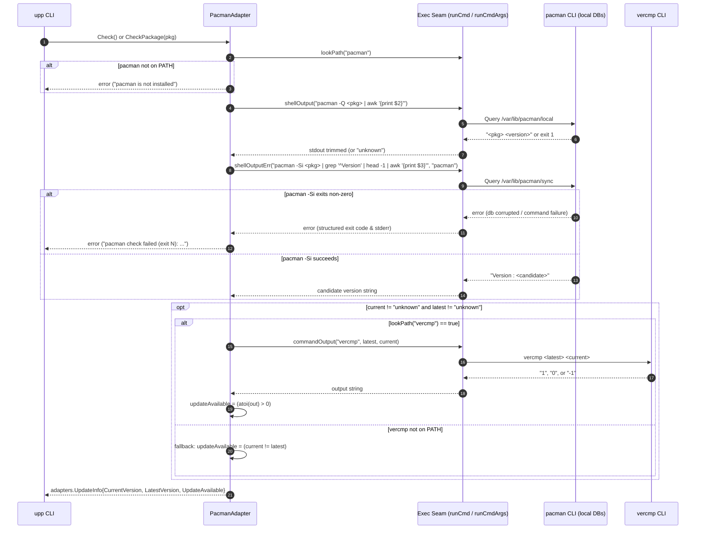
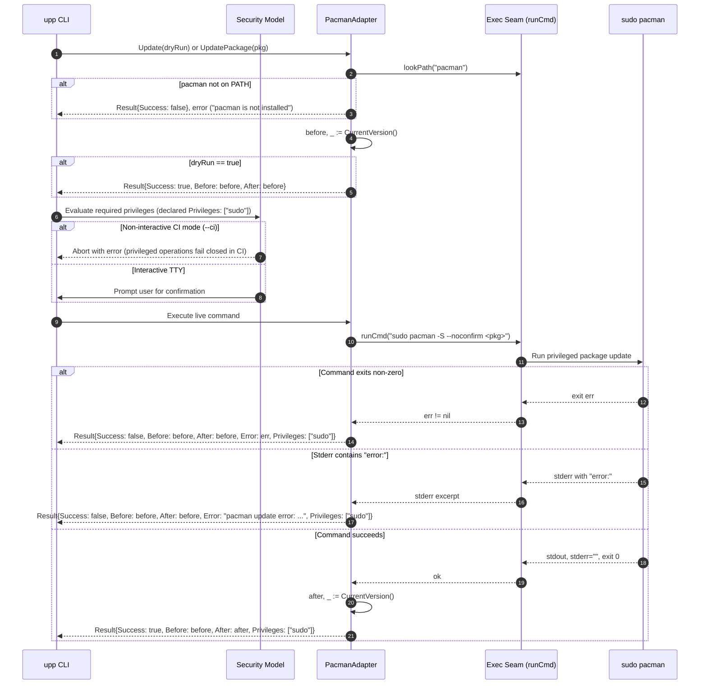

# Design: upp-pacman-adapter — Pacman Package Manager Adapter

## Technical Approach

The `upp-pacman-adapter` change introduces native Arch Linux and Arch-based distribution (CachyOS, Manjaro, EndeavourOS, Artix) package manager support to `upp`. The implementation is housed in `internal/adapters/official/pacman.go` as `PacmanAdapter`, providing official implementations of `adapters.Adapter`, `adapters.PackageChecker`, and `adapters.PackageUpdater`.

The technical approach adheres to four fundamental principles:
1. **Self-Only Manager Updates**: `upp update` updates only the `pacman` package manager binary (`sudo pacman -S --noconfirm pacman`), strictly avoiding whole-system rolling upgrades (`pacman -Syu`).
2. **Root-Free Local Database Inspection**: Version queries for both installed packages (`pacman -Q <pkg>`) and sync repository candidates (`pacman -Si <pkg>`) query local databases (`/var/lib/pacman/local` and `/var/lib/pacman/sync`) without requiring superuser privileges and without mutating sync databases (`pacman -Sy` is forbidden during check).
3. **Accurate Arch Version Ordering**: Utilizes `vercmp` (standard upstream binary shipped with pacman) when available on `PATH` to resolve Arch version syntax nuances (epochs `1:2.0-1`, pkgrels `-2`, and pre-release identifiers), falling back to string inequality if `vercmp` is absent.
4. **Security Model & Privilege Classification**: Mutating update operations (`Update` and `UpdatePackage`) execute via `sudo` and return `Privileges: []string{"sudo"}` on `adapters.Result`, ensuring interactive confirmation prompts in TTY sessions and failing closed in non-interactive `--ci` mode.

The adapter registers statically in `internal/adapters/official/registry.go` (`AllAdapters()`) and `internal/platform/catalog.go` (`OfficialTools`), maintaining strict 1:1 parity enforced by existing tests.

---

## Architecture Decisions

### D1: PacmanAdapter Structure and Interface Implementation
- **Context**: `upp` requires manager adapters to implement the base `adapters.Adapter` interface and, if declaring `KindManager`, to implement `adapters.PackageChecker` and `adapters.PackageUpdater` to support owned tools and custom tools configured with `manager = "pacman"`.
- **Choice**: Implement `PacmanAdapter` in `internal/adapters/official/pacman.go` implementing `Adapter` (`Name`, `Detect`, `Check`, `Update`, `Info`), `PackageChecker` (`CheckPackage`), and `PackageUpdater` (`UpdatePackage`).
- **Alternatives Considered**:
  - *Alternative A: Composite AUR Helper Adapter (e.g. `yay` or `paru`)*. Rejected because AUR helpers build from source PKGBUILDs, require interactive user prompts, introduce foreign repositories, and run as non-root with internal sudo delegation, conflicting with `upp`'s deterministic binary package update model.
  - *Alternative B: Implement only `Adapter` without `PackageChecker` / `PackageUpdater`*. Rejected because `parity_test.go` and `tool-ownership-model` require all `KindManager` adapters to implement `PackageChecker` and `PackageUpdater` to enable manager-group bulk updates and custom package delegations.
- **Rationale**: Direct structural parity with `AptAdapter` preserves uniform manager semantics across Linux distributions. Declaring `KindManager` and `PolicyGated` ensures pacman is treated as a first-class package manager in CLI output, filtering, and gating.

### D2: Root-Free Local Database Inspection and Prohibition of `pacman -Sy`
- **Context**: Package inspection in `upp check` and `upp update` runs periodically and in parallel across tools. It must be fast, non-blocking, safe, and must never require root credentials or cause unintended system mutations.
- **Choice**:
  - Installed version query: `bash -o pipefail -c 'pacman -Q <pkg> 2>/dev/null | awk "{print \$2}"'` via `shellOutput`.
  - Candidate sync version query: `bash -o pipefail -c 'pacman -Si <pkg> 2>/dev/null | grep -E "^Version" | head -1 | awk "{print \$3}"'` via `shellOutputErr`.
  - Strictly prohibit executing `pacman -Sy` (refresh database) during check or update.
- **Alternatives Considered**:
  - *Alternative A: Execute `pacman -Sy` or `checkupdates` before inspecting candidate versions*. Rejected because `pacman -Sy` mutates sync databases without upgrading packages (the classic Arch Linux partial-upgrade footgun that breaks dynamic library linking), requires network access, and requires root/sudo privileges. `checkupdates` is an optional script in `pacman-contrib` that may not be installed.
  - *Alternative B: Direct parsing of `/var/lib/pacman/` database files in Go or CGo bindings to `libalpm`*. Rejected because it introduces CGo dependencies or brittle binary/text parser maintenance for internal pacman database formats, whereas `pacman -Q` and `pacman -Si` provide stable, scriptable interfaces.
- **Rationale**: `pacman -Q` reads the local installed database (`/var/lib/pacman/local/`) and `pacman -Si` reads local sync databases (`/var/lib/pacman/sync/`), both completely root-free. Using `head -1` on `pacman -Si` output respects repository precedence configured in `/etc/pacman.conf` (e.g. CachyOS/custom repos prioritized over Arch extra/core). Pipeline failure detection using `bash -o pipefail` ensures non-zero exit codes propagate cleanly.

### D3: Version Comparison Strategy via `vercmp` with Fallback
- **Context**: Arch Linux package versions follow complex versioning schemes including epochs and package releases (`[epoch:]pkgver-pkgrel`, e.g., `1:6.1.0-2` vs `7.0.0-1`). Standard semver parsers fail on these strings (e.g., `1:` epoch or `-2` pkgrel).
- **Choice**:
  - When `vercmp` is available on `PATH` (shipped standard with `pacman`), execute `vercmp <candidate> <current>` via the adapter test seam (`commandOutput("vercmp", latest, current)`). If `vercmp` returns an integer > 0, an update is available; if <= 0, no update is available.
  - If `vercmp` is unavailable on `PATH` or returns non-integer output, gracefully fall back to string inequality (`current != latest`).
  - If either `current` or `latest` is `"unknown"`, or if `current == latest`, report `UpdateAvailable = false`.
- **Alternatives Considered**:
  - *Alternative A: Port the ALPM version comparison algorithm directly into Go*. Rejected as unnecessarily complex and prone to edge-case parity drift with official pacman ALPM C implementation; `vercmp` is installed on 100% of standard Arch systems alongside pacman.
  - *Alternative B: Use pure string inequality without `vercmp`*. Rejected because string comparison cannot handle Arch epochs (where `1:6.0` is newer than `7.0`), pkgrel comparisons (`6.0-2` vs `6.0-1`), or pre-release tags, causing false update notifications or downgrades.
- **Rationale**: Leveraging `vercmp` provides 100% accurate, upstream-blessed Arch package version ordering. The fallback to string inequality ensures graceful degradation in constrained test environments or minimal containers where `vercmp` might be absent.

### D4: Self-Update and Package Update Commands with Sudo Privilege Declaration
- **Context**: Updating system packages on Arch Linux requires superuser privileges (`sudo`). Furthermore, `upp update` must strictly adhere to the self-only manager update contract and must never trigger a system-wide upgrade (`pacman -Syu`).
- **Choice**:
  - Self-update command (`Update`): `sudo pacman -S --noconfirm pacman`.
  - Package update command (`UpdatePackage`): `sudo pacman -S --noconfirm <pkg>`.
  - Both update methods return `adapters.Result` declaring `Privileges: []string{"sudo"}`.
  - Dry-run mode (`dryRun = true`) bypasses command execution and returns before/after versions without sudo execution.
  - Non-zero command exit or stderr containing `"error:"` is captured and reported as a failed `Result` with a truncated 200-char error excerpt.
- **Alternatives Considered**:
  - *Alternative A: Run `pacman -Syu` during manager update*. Strictly rejected because `upp` manages individual developer tools; whole-system rolling upgrades violate `upp`'s scope and risk breaking un-reviewed system components.
  - *Alternative B: Omit `sudo` and assume the user runs `upp` as root*. Rejected because `upp` is a user-level CLI that runs in non-root environments and uses explicit privilege classification for security and `--ci` fail-closed semantics.
- **Rationale**: Target-specific package re-installation (`pacman -S <pkg>`) updates the specified package to its latest sync database candidate. Declaring `Privileges: ["sudo"]` integrates seamlessly with `upp`'s security confirmation model: interactive users receive confirmation prompts, and non-interactive `--ci` runs fail closed safely.

### D5: Registry and Catalog Integration
- **Context**: `upp` maintains two mirrored registries of official tools: `internal/adapters/official/registry.go` (`AllAdapters()`) and `internal/platform/catalog.go` (`OfficialTools`). Parity tests strictly enforce that every adapter is registered in both, platforms match, and ownership metadata matches.
- **Choice**:
  - Register `&PacmanAdapter{}` in `AllAdapters()`. Total official adapters increases from 12 to 13.
  - Register `{ID: "pacman", Name: "Pacman Package Manager", Platforms: []string{OSLinux}, Kind: adapters.KindManager}` in `OfficialTools`.
  - Update `OwnerMetadata`: 5 managers (apt, brew, pacman, winget, scoop) and 8 tools (total 13).
  - Update `parity_test.go`'s `TestManagerAdaptersImplementPackageInterfaces` to assert that `pacman` implements `PackageUpdater` and `PackageChecker`.
- **Alternatives Considered**:
  - *Alternative A: Register pacman dynamically based on Linux distribution detection*. Rejected because `AllAdapters()` and `OfficialTools` are static definitions representing the platform capability catalog; runtime enablement is filtered via `Detect()`.
  - *Alternative B: Reassign built-in Linux tools (`gh`, `docker`) to be owned by `pacman`*. Rejected and deferred; `gh` and `docker` remain mapped to `apt` on Linux until dynamic distro-aware ownership resolution is implemented in a separate change.
- **Rationale**: Static registration satisfies the strict parity assertions in `parity_test.go`, maintains zero runtime overhead, and cleanly exposes pacman on Linux hosts.

---

## Data Flow

### 1. Version Inspection Flow (`Check()` and `CheckPackage(pkg)`)



### 2. Update Execution Flow (`Update(dryRun)` and `UpdatePackage(pkg)`)



---

## File Changes

| File | Action | Description |
|------|--------|-------------|
| `internal/adapters/official/pacman.go` | Create | Implements `PacmanAdapter` satisfying `Adapter`, `PackageChecker`, and `PackageUpdater` |
| `internal/adapters/official/registry.go` | Modify | Registers `&PacmanAdapter{}` in `AllAdapters()` |
| `internal/platform/catalog.go` | Modify | Adds `pacman` entry to `OfficialTools` |
| `internal/adapters/official/registry_test.go` | Modify | Updates adapter count (12 → 13), Linux platform presence, manager consistency, and cardinality tests |
| `internal/adapters/official/parity_test.go` | Modify | Asserts `pacman` implements `PackageChecker` and `PackageUpdater` in `TestManagerAdaptersImplementPackageInterfaces` |
| `internal/adapters/official/info_test.go` | Modify | Adds golden metadata assertion for `pacman` in `TestInfo` |
| `internal/adapters/official/detect_test.go` | Modify | Adds `pacman` lookPath test cases in `TestDetect` |
| `internal/adapters/official/adapter_test.go` | Modify | Adds `pacman` name assertion in `TestAdapterNames` |
| `internal/adapters/official/check_test.go` | Modify | Adds mock check and package check table test rows for `pacman` |
| `internal/adapters/official/update_test.go` | Modify | Adds mock update and package update table test rows for `pacman` |
| `openspec/specs/tool-adapter/spec.md` | Delta | Documented in `openspec/changes/upp-pacman-adapter/specs/tool-adapter/spec.md` |
| `openspec/specs/platform-detection/spec.md` | Delta | Documented in `openspec/changes/upp-pacman-adapter/specs/platform-detection/spec.md` |
| `openspec/specs/tool-ownership-model/spec.md` | Delta | Documented in `openspec/changes/upp-pacman-adapter/specs/tool-ownership-model/spec.md` |
| `openspec/specs/security-model/spec.md` | Delta | Documented in `openspec/changes/upp-pacman-adapter/specs/security-model/spec.md` |

---

## Interfaces / Contracts

### 1. `PacmanAdapter` Struct and Method Signatures

```go
package official

import (
	"fmt"
	"strconv"
	"strings"

	"github.com/JhnFrankz/upp/internal/adapters"
)

// PacmanAdapter manages Pacman packages on Arch Linux and Arch-based distributions.
type PacmanAdapter struct{}

// Interface assertions enforcing compile-time compliance
var (
	_ adapters.Adapter        = (*PacmanAdapter)(nil)
	_ adapters.PackageChecker = (*PacmanAdapter)(nil)
	_ adapters.PackageUpdater = (*PacmanAdapter)(nil)
)

func (a *PacmanAdapter) Name() string
func (a *PacmanAdapter) Detect() bool
func (a *PacmanAdapter) Check() (adapters.UpdateInfo, error)
func (a *PacmanAdapter) Update(dryRun bool) (adapters.Result, error)
func (a *PacmanAdapter) Info() adapters.ToolInfo
func (a *PacmanAdapter) CheckPackage(pkg string) (adapters.UpdateInfo, error)
func (a *PacmanAdapter) UpdatePackage(pkg string) (adapters.Result, error)
func (a *PacmanAdapter) CurrentVersion() (string, error)
func (a *PacmanAdapter) compareVersions(current, latest string) bool
```

### 2. Method Implementation Contracts

```go
func (a *PacmanAdapter) Name() string { return "pacman" }

func (a *PacmanAdapter) Detect() bool {
	return lookPath("pacman")
}

func (a *PacmanAdapter) Info() adapters.ToolInfo {
	return adapters.ToolInfo{
		ID:           "pacman",
		Name:         "Pacman Package Manager",
		Platforms:    []string{"linux"},
		Trust:        adapters.TrustOfficial,
		UpdatePolicy: adapters.PolicyGated,
		Kind:         adapters.KindManager,
	}
}

func (a *PacmanAdapter) CurrentVersion() (string, error) {
	stdout := shellOutput("bash -o pipefail -c 'pacman -Q pacman 2>/dev/null | awk \"{print \\$2}\"'")
	v := strings.TrimSpace(stdout)
	if v == "" {
		return "unknown", nil
	}
	return v, nil
}

func (a *PacmanAdapter) compareVersions(current, latest string) bool {
	if current == latest {
		return false
	}
	if lookPath("vercmp") {
		out := commandOutput("vercmp", latest, current)
		if n, err := strconv.Atoi(strings.TrimSpace(out)); err == nil {
			return n > 0
		}
	}
	return current != latest
}

func (a *PacmanAdapter) Check() (adapters.UpdateInfo, error) {
	return a.CheckPackage("pacman")
}

func (a *PacmanAdapter) CheckPackage(pkg string) (adapters.UpdateInfo, error) {
	if !a.Detect() {
		return adapters.UpdateInfo{}, fmt.Errorf("pacman is not installed")
	}

	installedCmd := fmt.Sprintf("bash -o pipefail -c 'pacman -Q %s 2>/dev/null | awk \"{print \\$2}\"'", pkg)
	stdout := shellOutput(installedCmd)
	current := strings.TrimSpace(stdout)
	if current == "" {
		current = "unknown"
	}

	candidateCmd := fmt.Sprintf("bash -o pipefail -c 'pacman -Si %s 2>/dev/null | grep -E \"^Version\" | head -1 | awk \"{print \\$3}\"'", pkg)
	stdout, err := shellOutputErr(candidateCmd, "pacman")
	if err != nil {
		return adapters.UpdateInfo{}, err
	}
	latest := strings.TrimSpace(stdout)
	if latest == "" {
		latest = "unknown"
	}

	updateAvailable := false
	if current != "unknown" && latest != "unknown" {
		updateAvailable = a.compareVersions(current, latest)
	}

	return adapters.UpdateInfo{
		CurrentVersion:  current,
		LatestVersion:   latest,
		UpdateAvailable: updateAvailable,
	}, nil
}

func (a *PacmanAdapter) Update(dryRun bool) (adapters.Result, error) {
	if !a.Detect() {
		return adapters.Result{Success: false}, fmt.Errorf("pacman is not installed")
	}

	before, _ := a.CurrentVersion()
	if dryRun {
		return adapters.Result{
			Success: true,
			Before:  before,
			After:   before,
		}, nil
	}

	_, stderr, err := runCmd("sudo pacman -S --noconfirm pacman")
	if err != nil {
		return adapters.Result{
			Success:    false,
			Before:     before,
			After:      before,
			Error:      fmt.Errorf("pacman update failed: %w", err),
			Privileges: []string{"sudo"},
		}, nil
	}

	if stderr != "" && strings.Contains(stderr, "error:") {
		return adapters.Result{
			Success:    false,
			Before:     before,
			After:      before,
			Error:      fmt.Errorf("pacman update error: %s", truncate(stderr, 200)),
			Privileges: []string{"sudo"},
		}, nil
	}

	after, _ := a.CurrentVersion()
	return adapters.Result{
		Success:    true,
		Before:     before,
		After:      after,
		Privileges: []string{"sudo"},
	}, nil
}

func (a *PacmanAdapter) UpdatePackage(pkg string) (adapters.Result, error) {
	if !a.Detect() {
		return adapters.Result{Success: false}, fmt.Errorf("pacman is not installed")
	}

	before, _ := a.CurrentVersion()
	_, stderr, err := runCmd(fmt.Sprintf("sudo pacman -S --noconfirm %s", pkg))
	if err != nil {
		return adapters.Result{
			Success:    false,
			Before:     before,
			After:      before,
			Error:      fmt.Errorf("pacman update failed: %w", err),
			Privileges: []string{"sudo"},
		}, nil
	}

	if stderr != "" && strings.Contains(stderr, "error:") {
		return adapters.Result{
			Success:    false,
			Before:     before,
			After:      before,
			Error:      fmt.Errorf("pacman update error: %s", truncate(stderr, 200)),
			Privileges: []string{"sudo"},
		}, nil
	}

	after, _ := a.CurrentVersion()
	return adapters.Result{
		Success:    true,
		Before:     before,
		After:      after,
		Privileges: []string{"sudo"},
	}, nil
}
```

### 3. Registry & Catalog Updates

In `internal/adapters/official/registry.go`:
```go
func AllAdapters() []adapters.Adapter {
	return []adapters.Adapter{
		&AptAdapter{},
		&BrewAdapter{},
		&PacmanAdapter{},
		&WingetAdapter{},
		&ScoopAdapter{},
		&NVMAdapter{},
		&NpmAdapter{},
		&PnpmAdapter{},
		&BunAdapter{},
		&GhAdapter{},
		&DockerAdapter{},
		&GoAdapter{},
		&OpenCodeAdapter{},
	}
}
```

In `internal/platform/catalog.go`:
```go
var OfficialTools = []ToolEntry{
	{ID: "apt", Name: "APT Package Manager", Platforms: []string{OSLinux}, Kind: adapters.KindManager},
	{ID: "brew", Name: "Homebrew", Platforms: []string{OSLinux, OSMacOS}, Kind: adapters.KindManager},
	{ID: "pacman", Name: "Pacman Package Manager", Platforms: []string{OSLinux}, Kind: adapters.KindManager},
	{ID: "winget", Name: "Windows Package Manager", Platforms: []string{OSWindows}, Kind: adapters.KindManager},
	{ID: "scoop", Name: "Scoop", Platforms: []string{OSWindows}, Kind: adapters.KindManager},
	...
}
```

---

## Testing Strategy

All testing follows `upp`'s strict TDD convention (`strict_tdd: true` in `openspec/config.yaml`). No live child processes run during unit and table tests; execution is entirely hermetic via the `setExecFakes` test seam (`runCmdFn`, `runCmdArgsFn`, `lookPathFn`).

### 1. Parity & Contract Assertions
- `registry_test.go`:
  - `TestAllAdaptersCount`: Total adapters asserted to equal 13 (was 12).
  - `TestAdaptersForPlatformLinux`: Asserts `"pacman"` is present.
  - `TestAdaptersForPlatformMacOS` / `Windows`: Asserts `"pacman"` is absent.
  - `TestKindManagerConsistency`: `managers["pacman"] = true`.
  - `TestManagerOwnedToolCardinality`: Asserts `pacman` owns 0 official tools on Linux.
  - `TestOwnerMetadata`: Asserts `Total == 13`, `Managers == 5`, `Tools == 8`.
  - `TestAdapterByName`: Asserts `AdapterByName("pacman")` returns non-nil with Name `"pacman"`.
- `parity_test.go`:
  - `TestEveryAdapterIsInCatalog`: Verifies `"pacman"` catalog entry matches.
  - `TestEveryCatalogEntryHasAdapter`: Verifies catalog `"pacman"` resolves to `PacmanAdapter`.
  - `TestCatalogPlatformsMatchAdapterPlatforms`: Verifies platforms `["linux"]`.
  - `TestCatalogOwnershipMatchesAdapter`: Verifies `KindManager`.
  - `TestManagerAdaptersImplementPackageInterfaces`: Asserts `pacman` implements `adapters.PackageUpdater` and `adapters.PackageChecker`.
- `info_test.go`:
  - `TestInfo`: Golden table entry asserting `ID: "pacman"`, `Name: "Pacman Package Manager"`, `Platforms: ["linux"]`, `Trust: TrustOfficial`, `UpdatePolicy: PolicyGated`, `Kind: KindManager`.
- `detect_test.go` & `adapter_test.go`:
  - `TestDetect`: On-path and missing PATH assertions via `lookPath`.
  - `TestAdapterNames`: Asserts `pacman` name is `"pacman"`.

### 2. Check Table Tests (`check_test.go`)
Table-driven tests covering command output parsing and error handling:
- `pacman/update-available`: Fakes `pacman -Q` returning `6.1.0-1`, `pacman -Si` returning `7.0.0-1`, `vercmp 7.0.0-1 6.1.0-1` returning `1`. Expects `UpdateAvailable: true`.
- `pacman/current`: Fakes identical installed and candidate versions (`7.0.0-1`). Expects `UpdateAvailable: false`.
- `pacman/epoch-precedence`: Fakes installed `1:6.1.0-1` and candidate `7.0.0-1`. `vercmp 7.0.0-1 1:6.1.0-1` returns `-1`. Expects `UpdateAvailable: false` (epoch in current takes precedence).
- `pacman/vercmp-fallback`: Fakes `vercmp` missing on PATH (`lookPath["vercmp"] = false`), installed `6.1.0-1`, candidate `7.0.0-1`. Expects `UpdateAvailable: true` via fallback string inequality.
- `pacman/candidate-command-fails`: Fakes `pacman -Si` failing with non-zero exit. Expects structured error containing `"pacman check failed"`.
- `pacman/not-installed-error`: Fakes `lookPath["pacman"] = false`. Expects error `"pacman is not installed"`.
- `TestCheckPackage`:
  - `pacman/available`: Target package `ripgrep` outdated. Expects `UpdateAvailable: true`.
  - `pacman/current`: Target package up-to-date. Expects `UpdateAvailable: false`.
  - `pacman/not-installed`: `pacman -Q` returns non-zero/empty. Current resolves to `"unknown"`, `UpdateAvailable: false`.
  - `pacman/multi-repo-priority`: Multi-repo output with multiple `Version` lines. Verifies `head -1` extracts the prioritized repository version.

### 3. Update Table Tests (`update_test.go`)
Table-driven tests covering mutating executions:
- `pacman/dry-run-shortcut`: `dryRun = true`. Verifies `sudo pacman -S` is NOT executed; returns before/after versions with `Success: true`.
- `pacman/not-installed-error`: Missing pacman binary returns error before command execution.
- `pacman/update-command-error`: Subprocess fails with execution error. Returns `Success: false`, `Privileges: ["sudo"]`.
- `pacman/stderr-marker-fails`: Command exits with `error: failed to commit transaction` in stderr. Returns `Success: false`, `Privileges: ["sudo"]`.
- `pacman/success`: Live command executes `sudo pacman -S --noconfirm pacman`. Returns `Success: true`, updated versions, `Privileges: ["sudo"]`.
- `TestUpdatePackage`:
  - `pacman/ripgrep-updates-owned-package`: Verifies `sudo pacman -S --noconfirm ripgrep` executes with `Privileges: ["sudo"]`.
  - `pacman/package-command-fails`: Subprocess failure returns structured error.
  - `pacman/stderr-marker-fails`: Stderr `error:` marker returns failure.

### 4. Strict TDD Sequence
1. **Phase 1 (RED)**: Update `registry_test.go`, `parity_test.go`, `info_test.go`, `detect_test.go`, and `adapter_test.go` to declare expectations for `pacman`. Running `go test ./...` fails.
2. **Phase 2 (GREEN - Skeleton)**: Create `internal/adapters/official/pacman.go` skeleton with method stubs; add `&PacmanAdapter{}` to `registry.go` and `catalog.go`. Parity and registry tests pass.
3. **Phase 3 (RED - Check Table Tests)**: Add test cases for `Check()` and `CheckPackage()` in `check_test.go`. Running `go test ./internal/adapters/official` fails on check assertions.
4. **Phase 4 (GREEN - Check & Version Logic)**: Implement `Check()`, `CheckPackage()`, `CurrentVersion()`, and `compareVersions()` in `pacman.go`. Check tests pass.
5. **Phase 5 (RED - Update Table Tests)**: Add test cases for `Update()` and `UpdatePackage()` in `update_test.go`. Running tests fails on update assertions.
6. **Phase 6 (GREEN - Update Logic)**: Implement `Update()` and `UpdatePackage()` in `pacman.go`. Update tests pass.
7. **Phase 7 (REFACTOR & Full Suite Verification)**: Run full test suite with race detector (`go test ./... -count=1 -race`), run linter/vet (`go vet ./...`), and run smoke test (`bash scripts/smoke-test.sh --skip-build`).
