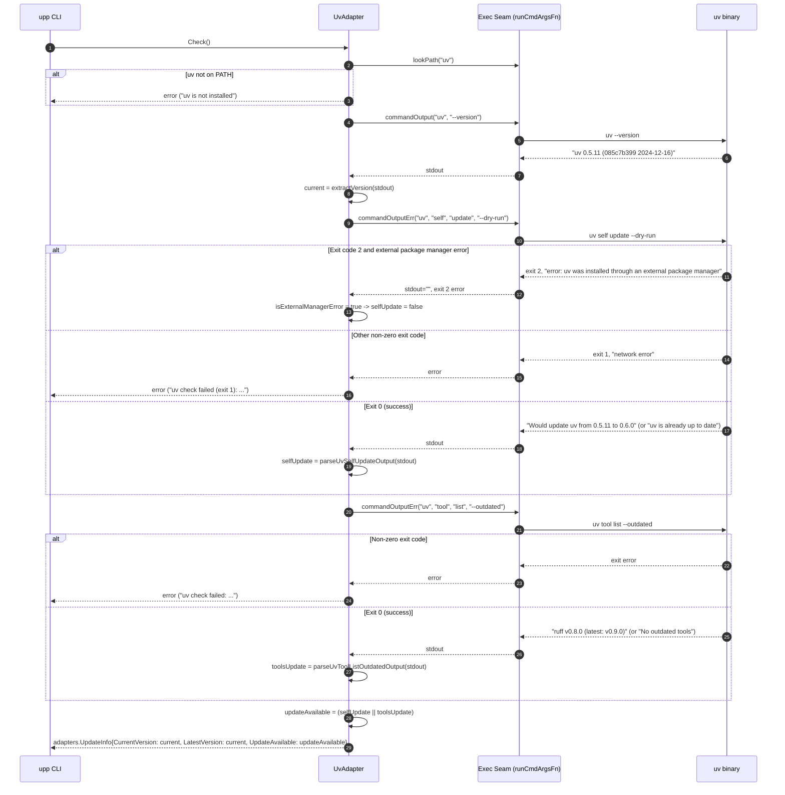
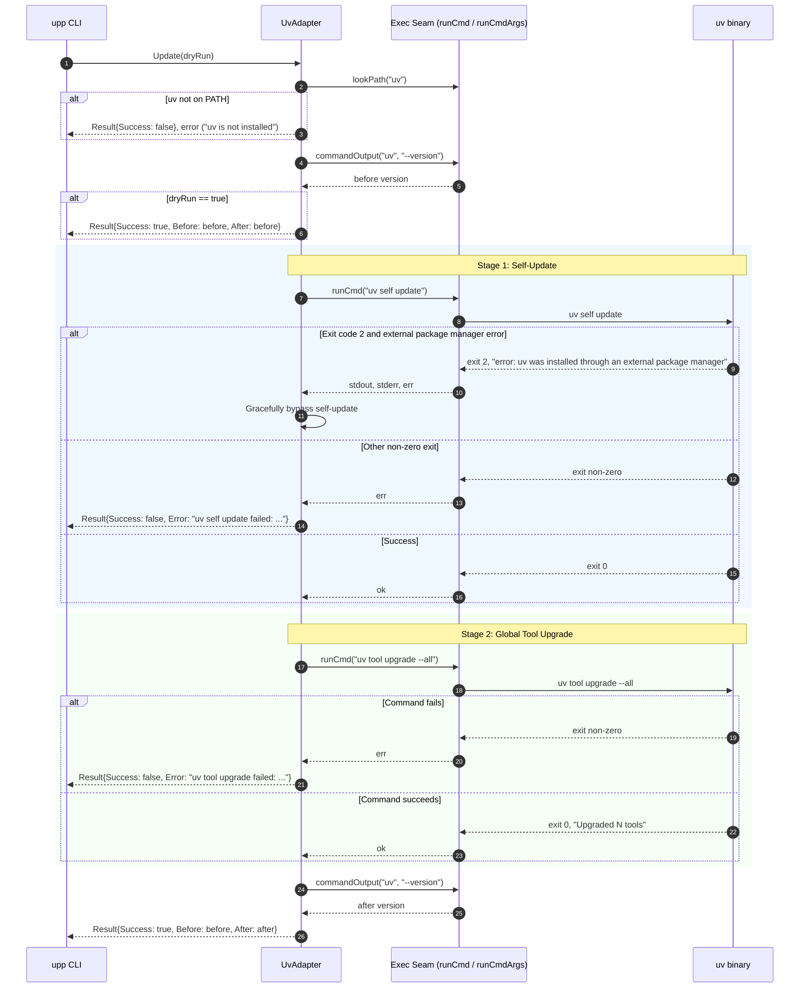

# Design: upp-uv-adapter — Astral uv Package & Tool Manager Adapter

## Technical Approach

The `upp-uv-adapter` change introduces first-class Python developer tooling and package management support to `upp` via Astral's high-performance `uv` toolchain. Housed in `internal/adapters/official/uv.go` as `UvAdapter`, it provides an official implementation of `adapters.Adapter` across all supported platforms (`linux`, `macos`, `windows`).

The technical approach adheres to five core architectural tenets:
1. **User-Space & Root-Free Execution**: `uv` and its isolated tool environments operate entirely in user-space (`~/.local/bin` on Linux/macOS, `%USERPROFILE%\.local\bin` or `%LOCALAPPDATA%\bin` on Windows). The adapter never requests or requires root or `sudo` privileges, declaring zero privilege escalations (`Privileges: nil`).
2. **Dual-Scope Execution**: A single invocation of `upp update` manages both layers of the `uv` toolchain: it updates the `uv` binary itself (`uv self update`) AND upgrades all globally installed Python CLI applications via `uv tool upgrade --all`.
3. **Dynamic External Package Manager Resilience**: Many developers install `uv` via system or external package managers (`brew`, `apt`, `pacman`, `winget`, `scoop`). When so installed, `uv self update` exits code 2 with `"error: uv was installed through an external package manager"`. The adapter dynamically intercepts this status code and stderr message, gracefully bypassing binary self-update without error, and proceeds immediately to upgrade global tools.
4. **Strict Gated Update Policy**: Declares `UpdatePolicy: adapters.PolicyGated`. In `upp list` and `upp update` pre-checks, it evaluates both `uv self update --dry-run` and `uv tool list --outdated`, setting `UpdateAvailable: true` only when a binary update or tool update is genuinely pending.
5. **Fail-Closed Diagnostics & Timeout Bounds**: Network failures, process hangs, or unexpected command errors fail closed per `Adapter Error Handling`, avoiding false current reporting. Subprocess executions are bounded by `adapters.CheckTimeout` (15s) and `adapters.UpdateTimeout` (120s) with process group termination.

The adapter registers statically in `internal/adapters/official/registry.go` (`AllAdapters()`) and `internal/platform/catalog.go` (`OfficialTools`), maintaining strict 1:1 bidirectional parity verified by the test suite.

---

## Architecture Decisions

### D1: UvAdapter Structure, Ownership Classification, and Policy Compliance
- **Context**: `upp` categorizes official adapters into managers (`KindManager`) and tools (`KindTool`), requiring each to declare static metadata including ID, Name, Platforms, Trust, UpdatePolicy, and Kind.
- **Choice**: Implement `UvAdapter` in `internal/adapters/official/uv.go` implementing `adapters.Adapter` (`Name`, `Detect`, `Check`, `Update`, `Info`). Declared as `KindTool`, `TrustOfficial`, `PolicyGated`, across `linux`, `macos`, and `windows`, with no owning manager (`Manager: nil`, `ManagerPackage: nil`). Zero privileges (`Privileges: nil`).
- **Alternatives Considered**:
  - *Alternative A: Declaring `KindManager`*. Rejected because `uv` does not manage system OS packages, other `upp` official tools (`gh`, `docker`, `go`), or custom tools via `manager = "uv"`. Making it a manager would violate `KindManagerConsistency` and require implementing `PackageChecker` and `PackageUpdater`.
  - *Alternative B: Delegated Platform Ownership (e.g. owned by `brew` on macOS, `winget` on Windows, `apt` on Linux)*. Rejected because uv is often installed standalone via Astral's standalone installer script (`curl -LsSf https://astral.sh/uv/install.sh`), and delegated ownership would prevent `uv tool upgrade --all` from executing when `upp update` runs.
  - *Alternative C: `PolicyAlwaysUpdate`*. Rejected because uv checks can reliably determine whether updates are pending via `uv self update --dry-run` and `uv tool list --outdated`. `PolicyGated` prevents unnecessary network calls and console churn during `upp update`.
- **Rationale**: Fully adheres to `upp`'s tool contract. Treating `uv` as a standalone `KindTool` across all platforms simplifies discovery and execution while allowing user-space toolchain management without root/sudo privilege escalation.

### D2: Dual-Scope Execution (`uv self update` + `uv tool upgrade --all`)
- **Context**: Unlike tools that only represent a single CLI binary (e.g., `bun upgrade`), Astral `uv` functions as both a binary toolchain and a global Python application runner/isolator (akin to `pipx`). Updating `uv` without updating installed tools leaves developer utilities outdated; updating tools without updating `uv` misses bugfixes and performance enhancements in the core resolver.
- **Choice**: In `Update(dryRun=false)`, execute a two-stage sequential workflow:
  1. Step 1: Self-update via `runCmd("uv self update")` (with external package manager bypass).
  2. Step 2: Global tool upgrades via `runCmd("uv tool upgrade --all")`.
  Both steps are executed sequentially within `Update()`, returning a combined `Result`.
- **Alternatives Considered**:
  - *Alternative A: Update only the uv binary (`uv self update`)*. Rejected because globally installed tools (`black`, `ruff`, `mypy`, `pytest`, `llm`, etc.) would remain outdated, forcing users to write custom commands.
  - *Alternative B: Two separate adapters (`uv` and `uv-tools`)*. Rejected as creating unnatural split-brain UX for a single developer toolchain, cluttering check boards and reports.
  - *Alternative C: Run `uv tool upgrade --all` only if `uv self update` updated*. Rejected because tools frequently have new releases even when the `uv` engine is at the latest version.
- **Rationale**: Unified dual-scope update aligns with developer expectations that `upp update` brings their entire Python CLI ecosystem up to date.

### D3: Dynamic External Package Manager Resilience
- **Context**: Users install `uv` through multiple distribution channels: standalone installer (`curl`/`powershell`), Homebrew (`brew install uv`), Windows Package Manager (`winget install astral-sh.uv`), Scoop (`scoop install uv`), Arch Linux (`pacman -S uv`), or Debian/Ubuntu (`apt install uv`). When installed via an external package manager, executing `uv self update` is intentionally disabled by Astral: it prints `error: uv was installed through an external package manager. Please use that package manager to update uv.` and exits with code 2.
- **Choice**: Implement helper function `isExternalManagerError(err error, output string) bool`. During both `Check()` (via `uv self update --dry-run`) and `Update()` (via `uv self update`), if the process exits with code 2 and the output/error contains `"external package manager"`, the adapter intercepts this error, bypasses binary self-update gracefully, treats binary self-update as false / no-op, and proceeds immediately to inspect or update global tools (`uv tool list --outdated` / `uv tool upgrade --all`). Any other non-zero exit code or unhandled failure fails closed.
- **Alternatives Considered**:
  - *Alternative A: Hardcode per-platform ownership (e.g. make brew own uv on macOS)*. Rejected because on macOS, many users install uv via standalone installer into `~/.local/bin`, and vice versa. Static mapping is brittle and fails when users choose different installation methods.
  - *Alternative B: Query `which uv` or inspect binary file path before running commands*. Rejected because binary path inspection (e.g. checking if path starts with `/opt/homebrew` or `/usr/bin`) is unreliable across diverse container environments, custom prefixes, symlinks, and cross-platform paths.
  - *Alternative C: Fail the update when `uv self update` fails*. Rejected because it would break `upp update` for all users who installed `uv` via system package managers, preventing them from upgrading global Python tools.
- **Rationale**: Runtime detection via exit code 2 and explicit error message provides 100% reliable, dynamic resilience without hardcoding assumptions about the user's installation method.

### D4: Root-Free Outdated Inspection in `Check()`
- **Context**: `upp check` runs concurrently across all detected tools, demanding high performance, non-root execution, and fail-closed diagnostics. `UvAdapter` declares `PolicyGated`, so `Check()` must return `UpdateAvailable: true` if and only if there are pending updates.
- **Choice**:
  1. Query installed version: `extractVersion(commandOutput("uv", "--version"))`.
  2. Query self-update availability: `commandOutputErr("uv", "self", "update", "--dry-run")`.
     - If exit code 2 + external package manager message: `selfUpdateAvailable = false`.
     - If other error: return structured error per Adapter Error Handling.
     - If success: `selfUpdateAvailable = parseUvSelfUpdateOutput(stdout)`.
  3. Query tool updates: `commandOutputErr("uv", "tool", "list", "--outdated")`.
     - If error: return structured error.
     - If success: `toolsUpdateAvailable = parseUvToolListOutdatedOutput(stdout)`.
  4. Gating result: `UpdateAvailable: selfUpdateAvailable || toolsUpdateAvailable`.
- **Alternatives Considered**:
  - *Alternative A: Only check version against GitHub Releases API or PyPI via HTTP*. Rejected because it introduces external network dependencies, rate limits, requires HTTP client boilerplate, and fails to check globally installed tools.
  - *Alternative B: Mark `UpdateAvailable: false` on `Check()` error*. Rejected because `upp` architectural tenets require fail-closed diagnostics; failed checks must never report tools as up-to-date or current.
  - *Alternative C: Check only self-update and skip tool checks in `Check()`*. Rejected because if only tools are outdated and `selfUpdateAvailable` is false, `upp update` would skip updating the tools due to `PolicyGated`.
- **Rationale**: Dual inspection using native `uv` dry-run and outdated listing provides accurate gating without root privileges or out-of-band network calls.

### D5: Catalog, Registry, and Parity Assertions
- **Context**: `upp` maintains strict dual registries: `internal/adapters/official/registry.go` (`AllAdapters()`) and `internal/platform/catalog.go` (`OfficialTools`), strictly verified by bidirectional parity tests in `parity_test.go` and count tests in `registry_test.go`.
- **Choice**:
  - Register `&UvAdapter{}` in `AllAdapters()`, raising total official adapters from 13 to 14.
  - Register `{ID: "uv", Name: "uv", Platforms: []string{OSLinux, OSMacOS, OSWindows}, Kind: adapters.KindTool}` in `OfficialTools`.
  - Update `OwnerMetadata` test assertions: Total 14, Managers 5, Tools 9 (8 → 9).
  - Update platform counts: Linux 11 → 12, macOS 9 → 10, Windows 10 → 11.
  - Add `"uv"` to `lookPathAdapters` in `detect_test.go`, `TestAdapterNames` in `adapter_test.go`, and `TestInfo` in `info_test.go`.
- **Alternatives Considered**:
  - *Alternative A: Register uv only on Linux and macOS*. Rejected because `uv` natively supports Windows and is widely used on Windows (`uv.exe`).
  - *Alternative B: Register uv under an alias such as `astral-uv`*. Rejected because Astral's CLI binary, package name, and ecosystem brand is uniformly `uv`.
- **Rationale**: Uniform cross-platform registration maintains clean 1:1 parity and extends Python tooling across all supported operating systems.

---

## Data Flow

### 1. Version and Update Inspection Flow (`Check()`)



### 2. Update Execution Flow (`Update(dryRun)`)



---

## File Changes

| File | Action | Description |
|------|--------|-------------|
| `internal/adapters/official/uv.go` | Create | Implements `UvAdapter` (`adapters.Adapter`) with dual self-update and global tool upgrade logic, exit code 2 resilience, and dry-run support |
| `internal/adapters/official/registry.go` | Modify | Registers `&UvAdapter{}` in `AllAdapters()` |
| `internal/platform/catalog.go` | Modify | Adds `uv` entry to `OfficialTools` across `OSLinux`, `OSMacOS`, and `OSWindows` as standalone `KindTool` |
| `internal/adapters/official/registry_test.go` | Modify | Updates adapter count (13 → 14), platform presence assertions (Linux 11 → 12, macOS 9 → 10, Windows 10 → 11), manager/tool consistency, tool cardinality (8 → 9 tools), and `AdapterByName` table |
| `internal/adapters/official/parity_test.go` | Modify / Verify | Verifies bidirectional catalog ⇄ adapter synchronization, platforms match, ownership matches, and names match |
| `internal/adapters/official/info_test.go` | Modify | Adds golden metadata assertion for `uv` in `TestInfo` |
| `internal/adapters/official/detect_test.go` | Modify | Adds `uv` to `lookPathAdapters` in `TestDetect` |
| `internal/adapters/official/adapter_test.go` | Modify | Adds `uv` name assertion in `TestAdapterNames` |
| `internal/adapters/official/check_test.go` | Modify | Adds table test rows for `uv` `Check()` (self-update, tool updates, external package manager bypass, and error cases) |
| `internal/adapters/official/update_test.go` | Modify | Adds table test rows for `uv` `Update()` (dry-run, live dual-scope execution, external manager bypass, and failure cases) |
| `openspec/changes/upp-uv-adapter/specs/tool-adapter/spec.md` | Delta | Specifications for official catalog, update gating, and dual-scope update execution |
| `openspec/changes/upp-uv-adapter/specs/platform-detection/spec.md` | Delta | Specifications for tool catalog across Linux, macOS, and Windows |
| `openspec/changes/upp-uv-adapter/specs/ux-patterns/spec.md` | Delta | Specifications for live check board and summary report rendering |

---

## Interfaces / Contracts

### 1. `UvAdapter` Struct and Method Signatures

```go
package official

import (
	"fmt"
	"strings"

	"github.com/JhnFrankz/upp/internal/adapters"
)

// UvAdapter manages Astral's uv toolchain and global Python tools on all platforms.
type UvAdapter struct{}

// Interface assertion enforcing compile-time compliance
var _ adapters.Adapter = (*UvAdapter)(nil)

func (a *UvAdapter) Name() string
func (a *UvAdapter) Detect() bool
func (a *UvAdapter) Check() (adapters.UpdateInfo, error)
func (a *UvAdapter) Update(dryRun bool) (adapters.Result, error)
func (a *UvAdapter) Info() adapters.ToolInfo
```

### 2. Pure Helper Functions

```go
// isExternalManagerError returns true if err indicates exit code 2 and output/err
// confirms uv was installed through an external package manager.
func isExternalManagerError(err error, output string) bool {
	if err == nil {
		return false
	}
	hasCode2 := isExitCode(err, 2) || strings.Contains(err.Error(), "(exit 2)") || strings.Contains(err.Error(), "exit status 2")
	combined := output + " " + err.Error()
	return hasCode2 && strings.Contains(combined, "external package manager")
}

// parseUvSelfUpdateOutput determines if `uv self update --dry-run` stdout indicates
// a pending update.
func parseUvSelfUpdateOutput(out string) bool {
	trimmed := strings.TrimSpace(out)
	if trimmed == "" {
		return false
	}
	lower := strings.ToLower(trimmed)
	if strings.Contains(lower, "up to date") || strings.Contains(lower, "already up to date") {
		return false
	}
	if strings.Contains(lower, "would update") || strings.Contains(lower, "new version") || strings.Contains(lower, "updating") {
		return true
	}
	return false
}

// parseUvToolListOutdatedOutput determines if `uv tool list --outdated` stdout indicates
// any outdated globally installed tools.
func parseUvToolListOutdatedOutput(out string) bool {
	trimmed := strings.TrimSpace(out)
	if trimmed == "" {
		return false
	}
	if strings.Contains(trimmed, "No tools installed") || strings.Contains(trimmed, "No outdated tools") {
		return false
	}
	return true
}
```

### 3. Implementation Methods Contract

```go
func (a *UvAdapter) Name() string { return "uv" }

func (a *UvAdapter) Detect() bool {
	return lookPath("uv")
}

func (a *UvAdapter) Info() adapters.ToolInfo {
	return adapters.ToolInfo{
		ID:           "uv",
		Name:         "uv",
		Platforms:    []string{"linux", "macos", "windows"},
		Trust:        adapters.TrustOfficial,
		UpdatePolicy: adapters.PolicyGated,
		Kind:         adapters.KindTool,
	}
}

func (a *UvAdapter) Check() (adapters.UpdateInfo, error) {
	if !a.Detect() {
		return adapters.UpdateInfo{}, fmt.Errorf("uv is not installed")
	}

	out := commandOutput("uv", "--version")
	current := extractVersion(out)
	if current == "" {
		current = "unknown"
	}

	// 1. Check binary self-update availability
	selfUpdateAvailable := false
	selfOut, selfErr := commandOutputErr("uv", "self", "update", "--dry-run")
	if selfErr != nil {
		if !isExternalManagerError(selfErr, selfOut) {
			return adapters.UpdateInfo{}, selfErr
		}
		// Gracefully bypassed: uv was installed through external package manager
		selfUpdateAvailable = false
	} else {
		selfUpdateAvailable = parseUvSelfUpdateOutput(selfOut)
	}

	// 2. Check outdated global tools
	toolOut, toolErr := commandOutputErr("uv", "tool", "list", "--outdated")
	if toolErr != nil {
		return adapters.UpdateInfo{}, toolErr
	}
	toolsUpdateAvailable := parseUvToolListOutdatedOutput(toolOut)

	updateAvailable := selfUpdateAvailable || toolsUpdateAvailable

	return adapters.UpdateInfo{
		CurrentVersion:  current,
		LatestVersion:   current,
		UpdateAvailable: updateAvailable,
	}, nil
}

func (a *UvAdapter) Update(dryRun bool) (adapters.Result, error) {
	if !a.Detect() {
		return adapters.Result{Success: false}, fmt.Errorf("uv is not installed")
	}

	before := extractVersion(commandOutput("uv", "--version"))
	if before == "" {
		before = "unknown"
	}

	if dryRun {
		return adapters.Result{
			Success: true,
			Before:  before,
			After:   before,
		}, nil
	}

	// Stage 1: Self-update binary
	stdout, stderr, err := runCmd("uv self update")
	if err != nil {
		if !isExternalManagerError(err, stderr+" "+stdout) {
			return adapters.Result{
				Success: false,
				Before:  before,
				After:   before,
				Error:   fmt.Errorf("uv self update failed: %w", err),
			}, nil
		}
		// External package manager error is bypassed; proceed to global tools
	}

	// Stage 2: Upgrade global Python tools
	_, stderr2, err2 := runCmd("uv tool upgrade --all")
	if err2 != nil {
		return adapters.Result{
			Success: false,
			Before:  before,
			After:   before,
			Error:   fmt.Errorf("uv tool upgrade failed: %w", err2),
		}, nil
	}

	after := extractVersion(commandOutput("uv", "--version"))
	if after == "" {
		after = before
	}

	return adapters.Result{
		Success: true,
		Before:  before,
		After:   after,
	}, nil
}
```

### 4. Registry & Catalog Updates

In `internal/adapters/official/registry.go`:
```go
func AllAdapters() []adapters.Adapter {
	return []adapters.Adapter{
		&AptAdapter{},
		&BrewAdapter{},
		&PacmanAdapter{},
		&WingetAdapter{},
		&ScoopAdapter{},
		&NVMAdapter{},
		&NpmAdapter{},
		&PnpmAdapter{},
		&BunAdapter{},
		&UvAdapter{},
		&GhAdapter{},
		&DockerAdapter{},
		&GoAdapter{},
		&OpenCodeAdapter{},
	}
}
```

In `internal/platform/catalog.go`:
```go
var OfficialTools = []ToolEntry{
	{ID: "apt", Name: "APT Package Manager", Platforms: []string{OSLinux}, Kind: adapters.KindManager},
	{ID: "brew", Name: "Homebrew", Platforms: []string{OSLinux, OSMacOS}, Kind: adapters.KindManager},
	{ID: "pacman", Name: "Pacman Package Manager", Platforms: []string{OSLinux}, Kind: adapters.KindManager},
	{ID: "winget", Name: "Windows Package Manager", Platforms: []string{OSWindows}, Kind: adapters.KindManager},
	{ID: "scoop", Name: "Scoop", Platforms: []string{OSWindows}, Kind: adapters.KindManager},
	{ID: "nvm", Name: "Node Version Manager", Platforms: []string{OSLinux, OSMacOS, OSWindows}, Kind: adapters.KindTool},
	{ID: "npm", Name: "npm", Platforms: []string{OSLinux, OSMacOS, OSWindows}, Kind: adapters.KindTool},
	{ID: "pnpm", Name: "pnpm", Platforms: []string{OSLinux, OSMacOS, OSWindows}, Kind: adapters.KindTool},
	{ID: "bun", Name: "Bun", Platforms: []string{OSLinux, OSMacOS, OSWindows}, Kind: adapters.KindTool},
	{ID: "uv", Name: "uv", Platforms: []string{OSLinux, OSMacOS, OSWindows}, Kind: adapters.KindTool},
	{ID: "gh", Name: "GitHub CLI", Platforms: []string{OSLinux, OSMacOS, OSWindows}, Kind: adapters.KindTool, Manager: map[string]string{OSLinux: "apt", OSMacOS: "brew", OSWindows: "winget"}, ManagerPackage: map[string]string{OSLinux: "gh", OSMacOS: "gh", OSWindows: "gh"}},
	{ID: "docker", Name: "Docker", Platforms: []string{OSLinux, OSMacOS, OSWindows}, Kind: adapters.KindTool, Manager: map[string]string{OSLinux: "apt", OSMacOS: "brew", OSWindows: "winget"}, ManagerPackage: map[string]string{OSLinux: "docker-ce", OSMacOS: "docker", OSWindows: "Docker.Docker"}},
	{ID: "go", Name: "Go", Platforms: []string{OSLinux, OSMacOS, OSWindows}, Kind: adapters.KindTool, Manager: map[string]string{OSMacOS: "brew", OSWindows: "winget"}, ManagerPackage: map[string]string{OSMacOS: "golang", OSWindows: "GoLang.Go"}},
	{ID: "opencode", Name: "OpenCode", Platforms: []string{OSLinux, OSMacOS, OSWindows}, Kind: adapters.KindTool},
}
```

---

## Testing Strategy

All testing follows `upp`'s strict TDD convention (`strict_tdd: true` in `openspec/config.yaml`). Execution during unit and table tests is 100% hermetic via the `setExecFakes` test seam (`runCmdFn`, `runCmdArgsFn`, `lookPathFn`); no live child processes or network requests run during unit testing.

### 1. Parity & Contract Assertions
- `registry_test.go`:
  - `TestAllAdaptersCount`: Total adapters asserted to equal 14 (was 13).
  - `TestAdaptersForPlatformLinux`: Asserts `"uv"` is present (11 → 12).
  - `TestAdaptersForPlatformMacOS`: Asserts `"uv"` is present (9 → 10).
  - `TestAdaptersForPlatformWindows`: Asserts `"uv"` is present (10 → 11).
  - `TestResolveOwner`: Asserts `ResolveOwner("uv", "linux")`, `ResolveOwner("uv", "macos")`, and `ResolveOwner("uv", "windows")` return `nil` (standalone tool on all platforms).
  - `TestKindManagerConsistency`: Asserts `uv` is classified as `KindTool`.
  - `TestOwnerMetadata`: Asserts `Total == 14`, `Managers == 5`, `Tools == 9` (8 → 9).
  - `TestAdapterByName`: Asserts `AdapterByName("uv")` returns non-nil with Name `"uv"`.
- `parity_test.go`:
  - `TestEveryAdapterIsInCatalog`: Verifies `"uv"` catalog entry exists in `platform.OfficialTools`.
  - `TestEveryCatalogEntryHasAdapter`: Verifies catalog `"uv"` resolves to `UvAdapter`.
  - `TestCatalogPlatformsMatchAdapterPlatforms`: Verifies platforms match `["linux", "macos", "windows"]`.
  - `TestCatalogOwnershipMatchesAdapter`: Verifies `KindTool`, `Manager == nil`, and `ManagerPackage == nil`.
  - `TestCatalogNamesMatchAdapterNames`: Verifies display name `"uv"` matches `Info().Name`.
- `info_test.go`:
  - `TestInfo`: Golden table entry asserting `ID: "uv"`, `Name: "uv"`, `Platforms: ["linux", "macos", "windows"]`, `Trust: TrustOfficial`, `UpdatePolicy: PolicyGated`, `Kind: KindTool`.
- `detect_test.go` & `adapter_test.go`:
  - `TestDetect`: On-path and missing PATH assertions via `lookPath`.
  - `TestAdapterNames`: Asserts `uv` name is `"uv"`.

### 2. Check Table Tests (`check_test.go`)
Table-driven tests covering command output parsing, exit code 2 bypass, and error handling:
- `uv/self-update-available`: Fakes `uv --version` returning `0.5.0`, `uv self update --dry-run` returning `Would update uv from 0.5.0 to 0.5.11`, `uv tool list --outdated` returning `No outdated tools`. Expects `UpdateAvailable: true`.
- `uv/tool-update-available`: Fakes `uv --version` returning `0.5.11`, `uv self update --dry-run` returning `uv is already up to date`, `uv tool list --outdated` returning `ruff v0.8.0 (latest: v0.9.0)`. Expects `UpdateAvailable: true`.
- `uv/both-available`: Fakes both self-update pending and outdated tools. Expects `UpdateAvailable: true`.
- `uv/up-to-date`: Fakes `uv --version` returning `0.5.11`, `uv self update --dry-run` returning `uv is already up to date`, `uv tool list --outdated` returning `No outdated tools`. Expects `UpdateAvailable: false`.
- `uv/no-tools-installed`: Fakes `uv tool list --outdated` returning `No tools installed`. Expects `UpdateAvailable: false`.
- `uv/external-manager-bypass-no-updates`: Fakes `uv self update --dry-run` exiting with code 2 and `"error: uv was installed through an external package manager"`, `uv tool list --outdated` returning `No outdated tools`. Expects `UpdateAvailable: false`, bypasses exit 2 cleanly without error.
- `uv/external-manager-bypass-with-tool-updates`: Fakes `uv self update --dry-run` exiting code 2 with external manager message, `uv tool list --outdated` returning `black v24.1.0 (latest: v24.2.0)`. Expects `UpdateAvailable: true`.
- `uv/self-update-other-nonzero-fails`: Fakes `uv self update --dry-run` failing with exit code 1 or network error. Expects structured error containing `(exit 1)`.
- `uv/tool-list-command-fails`: Fakes `uv tool list --outdated` failing with non-zero exit code. Expects structured error.
- `uv/not-installed-error`: Fakes `lookPath["uv"] = false`. Expects error `"uv is not installed"`.
- `uv/empty-version-unknown`: Fakes `uv --version` returning empty string. Expects `CurrentVersion: "unknown"`, `UpdateAvailable: false`.

### 3. Update Table Tests (`update_test.go`)
Shared update command constants:
```go
const (
	uvSelfUpdateCmd  = "uv self update"
	uvToolUpgradeCmd = "uv tool upgrade --all"
)
```
Table-driven tests covering dry-run and live dual-scope executions:
- `uv/not-installed-error`: Missing uv binary returns error before command execution.
- `uv/dry-run-shortcut`: `dryRun = true`. Verifies `uv self update` and `uv tool upgrade --all` are NOT executed (`failIfRun`). Returns `Success: true` with identical before and after versions.
- `uv/success-dual-scope`: Standalone uv. Fakes `uv --version` returning `0.5.0` initially and `0.5.11` after update. `uv self update` succeeds; `uv tool upgrade --all` succeeds. Expects `Success: true`, `Before: "0.5.0"`, `After: "0.5.11"`.
- `uv/external-manager-bypass-success`: Fakes `uv self update` failing with exit code 2 and stderr `"error: uv was installed through an external package manager"`. Self-update error is gracefully bypassed; `uv tool upgrade --all` executes and succeeds. Expects `Success: true`, `Before: "0.5.11"`, `After: "0.5.11"`.
- `uv/self-update-unexpected-failure`: Fakes `uv self update` failing with exit code 1 / network error. Verifies `uv tool upgrade --all` is NOT executed. Expects `Success: false`, `resultErr: true`.
- `uv/tool-upgrade-failure`: Fakes `uv self update` succeeding, but `uv tool upgrade --all` failing with execution error. Expects `Success: false`, `resultErr: true`.

### 4. Strict TDD Sequence
1. **Phase 1 (RED - Registry & Parity Failures)**:
   - Update `registry_test.go` to assert 14 total adapters, platform presence on Linux, macOS, and Windows, and metadata counts (5 managers, 9 tools).
   - Update `parity_test.go`, `info_test.go`, `detect_test.go`, and `adapter_test.go` to include `uv`.
   - Running `go test ./internal/adapters/official` fails because `UvAdapter` does not exist yet.
2. **Phase 2 (GREEN - Adapter Skeleton & Registration)**:
   - Create `internal/adapters/official/uv.go` skeleton implementing `adapters.Adapter` with method stubs.
   - Register `&UvAdapter{}` in `internal/adapters/official/registry.go` (`AllAdapters()`).
   - Register `ToolEntry` in `internal/platform/catalog.go` (`OfficialTools`).
   - Parity and registry tests pass.
3. **Phase 3 (RED - Check Table Tests)**:
   - Add table-driven check test cases in `check_test.go` covering all self-update, tool-update, and external manager bypass scenarios.
   - Running check tests fails on `UvAdapter.Check()`.
4. **Phase 4 (GREEN - Check Implementation)**:
   - Implement `Check()`, `isExternalManagerError()`, `parseUvSelfUpdateOutput()`, and `parseUvToolListOutdatedOutput()` in `uv.go`.
   - Check table tests pass.
5. **Phase 5 (RED - Update Table Tests)**:
   - Add table-driven update test cases in `update_test.go` covering dry-run, live dual-scope execution, external manager bypass, and stage failure aborts.
   - Running update tests fails on `UvAdapter.Update()`.
6. **Phase 6 (GREEN - Update Implementation)**:
   - Implement `Update(dryRun)` in `uv.go` with two-stage execution and exit code 2 resilience.
   - Update table tests pass.
7. **Phase 7 (REFACTOR & Full Verification)**:
   - Run full test suite with race detector: `go test ./... -count=1 -race`.
   - Run static analysis: `go vet ./...`.
   - Run repository smoke check: `bash scripts/smoke-test.sh --skip-build`.
