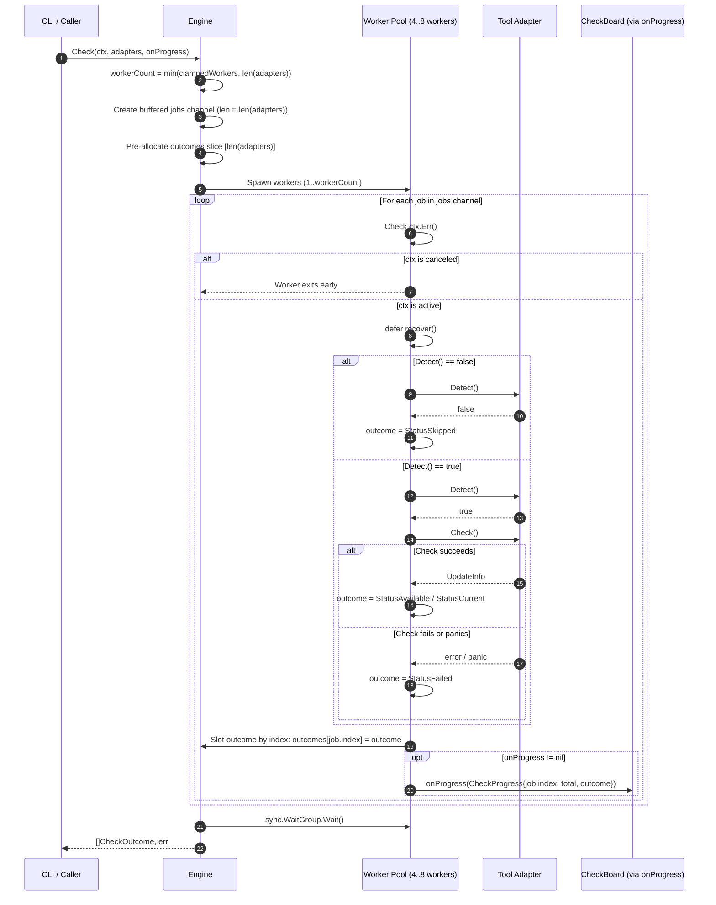
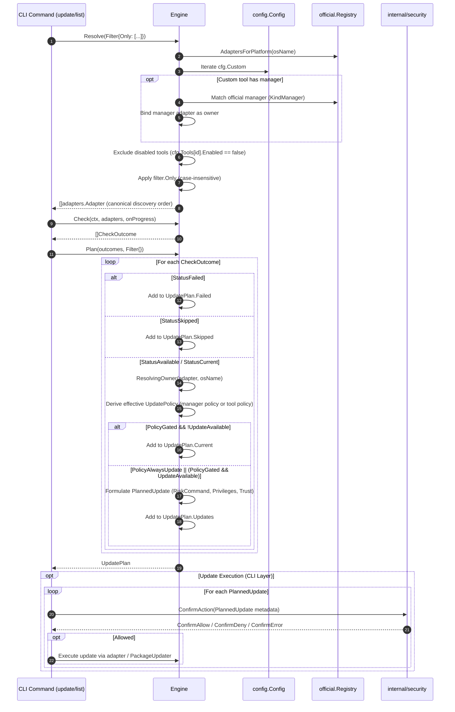
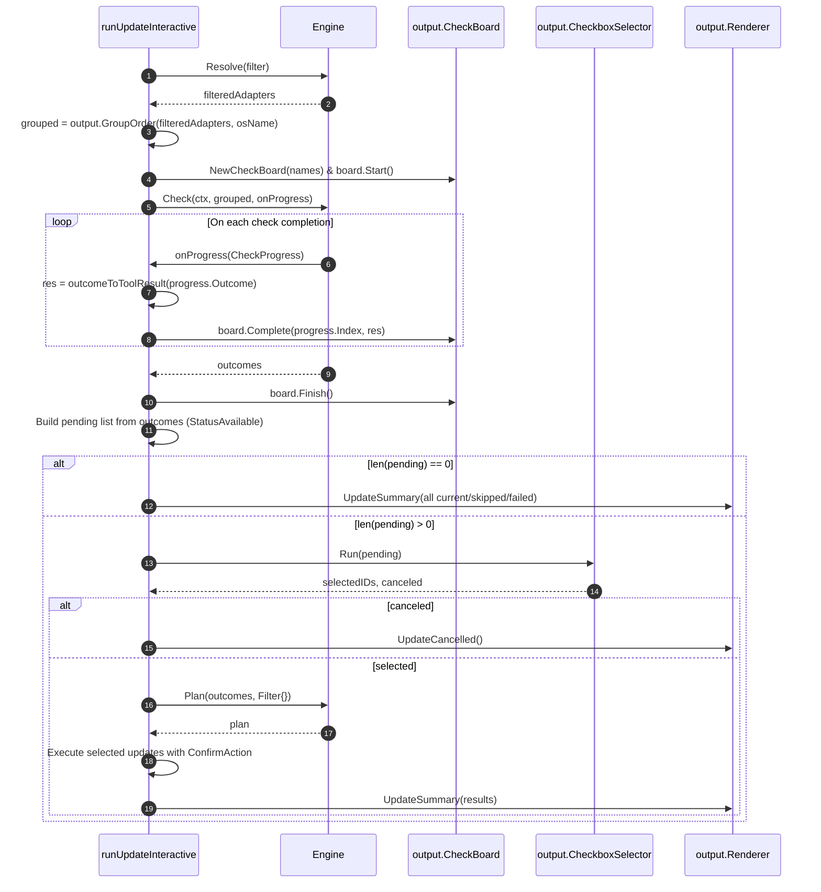

# Design: upp-application-engine — Application Engine Layer Extraction

## Technical Approach

The `upp-application-engine` architectural change introduces a dedicated, headless Application Engine (`internal/engine`) situated directly between the command-line presentation layer (`internal/cli`) and the lower-level adapter ecosystem (`internal/adapters`, `internal/adapters/official`).

Currently, `internal/cli` suffers from presentation-domain coupling:
1. **Domain Orchestration in Presentation**: `internal/cli` directly coordinates tool adapter discovery, custom tool manager ownership binding (`buildAdapterList`), worker pool sizing and core clamping ($[4, 8]$ via `calculateWorkerCount`), deferred panic containment (`safeCheck`), concurrent version check dispatching (`runChecks`), and manager-owned tool update policy inheritance (`resolveEffectiveUpdatePolicy`, `resolvingOwner`).
2. **Presentation Model Entanglement**: `checkrun.go` imports `internal/output` and returns presentation types (`output.ToolResult`, `output.StatusAvailable`, `output.StatusCurrent`, `output.StatusSkipped`, `output.StatusFailed`). Core version check workflows cannot execute or be tested headlessly without instantiating terminal UI models.
3. **Absence of Cooperative Cancellation**: `runChecks` does not accept a `context.Context`. If an interrupt signal (`SIGINT` / Ctrl+C) or an operational deadline occurs, ongoing worker goroutines cannot be canceled cooperatively and continue executing subprocesses until completion.
4. **Scattered Policy Rules**: Logic for manager-tool ownership mapping, delegation, and effective policy gating (e.g., owned tools inheriting their manager's `UpdatePolicy` while the owned tool's declared policy is inert) is entangled with terminal output loops in `runUpdateSequential` and `runUpdateInteractive`.

To resolve these architectural issues, the technical approach extracts a headless Application Engine (`internal/engine`) adhering to five core tenets:
1. **Pure Domain Model Isolation**: The engine defines and operates exclusively on presentation-free domain types (`CheckStatus`, `CheckOutcome`, `CheckProgress`, `UpdatePlan`, `PlannedUpdate`, `Filter`). The package contains zero imports of `internal/output`, `github.com/spf13/cobra`, or BubbleTea.
2. **Bounded Concurrency & Panic Containment**: Worker pool concurrency is dynamically computed and strictly clamped to $[4, 8]$ based on `runtime.NumCPU()`. Every worker goroutine encapsulates adapter operations in deferred `recover()` blocks, ensuring failing or panicking adapters never crash the engine or halt other checks.
3. **Cooperative Context Cancellation**: `Engine.Check` accepts a `context.Context`. Workers monitor `ctx.Err()` before task pickup and execution, draining gracefully via `sync.WaitGroup` with guaranteed zero goroutine leaks.
4. **Centralized Discovery & Planning**: Adapter enumeration, platform filtering, custom tool manager binding, and policy-driven update planning (`PolicyGated` vs. `PolicyAlwaysUpdate`, owned tool policy inheritance) are centralized in `Engine.Resolve` and `Engine.Plan`.
5. **Seamless CLI Bridge & Dep Preservation**: `internal/cli` delegates orchestration to `engine.Engine` while maintaining all existing dependency injection seams (`cliDeps`, `updateDeps`, `listDeps`), ensuring 100% byte-for-byte visual, behavioral, and hermetic test compatibility.

---

## Architecture Decisions

### D1: Layered Package Placement (`internal/engine`)

- **Context**: `internal/cli` coordinates tool adapters, configuration, platform detection, and output rendering. Core business logic cannot be consumed headlessly or tested without invoking CLI presentation code.
- **Choice**: Place `internal/engine` between `internal/cli` and `internal/adapters`. The dependency hierarchy is strictly unidirectional:
  ```
  cmd/upp/main.go
         │
         ▼
    internal/cli ──────────┐
         │                 ▼
         │          internal/output
         ▼
   internal/engine
         │
         ├──────────────┬──────────────┬──────────────┐
         ▼              ▼              ▼              ▼
  internal/adapters  internal/    internal/      internal/
  (official/custom)  platform     config         security
  ```
  `internal/engine` MUST NOT import `internal/cli` or `internal/output`.
- **Alternatives Considered**:
  - *Alternative A: Domain logic in `internal/adapters`*. Rejected because adapters represent individual tool drivers. Forcing adapters to handle configuration parsing, cross-tool worker pools, and update planning would create severe circular import dependencies (`adapters` -> `config` -> `adapters`).
  - *Alternative B: Public engine package in `pkg/engine`*. Rejected because `upp` is an integrated single-binary CLI application, not a reusable third-party library SDK. Placing code in `internal/` protects internal invariants and avoids premature public API commitments.
  - *Alternative C: Retain logic in `internal/cli` split across additional files*. Rejected because it leaves presentation types entangled with domain models and prevents headless programmatic execution and testing.
- **Rationale**: Layered placement enforces a clean separation of concerns: presentation lives in `internal/cli`, output formatting lives in `internal/output`, domain orchestration lives in `internal/engine`, and tool mechanics live in `internal/adapters`.

### D2: Pure Domain Model Isolation

- **Context**: `checkrun.go` currently constructs `output.ToolResult` directly, embedding ANSI string conventions, formatted version transitions (`"1.0.0 → 2.0.0"`), and terminal status types during check execution.
- **Choice**: Define pure domain types in `internal/engine/types.go`:
  - `CheckStatus`: Typed enum (`StatusAvailable`, `StatusCurrent`, `StatusSkipped`, `StatusFailed`).
  - `CheckOutcome`: Domain outcome struct holding `ToolID`, `ToolName`, `Status`, `CurrentVersion`, `LatestVersion`, `UpdateAvailable`, `Err`, `Stderr`, and `RawUpdateInfo`.
  - `CheckProgress`: Progress notification carrying `Index`, `Total`, and `Outcome`.
  - `Filter`: Query criteria carrying `Only []string`.
  - `PlannedUpdate`: Update action carrying `ToolID`, `ToolName`, `ManagerID`, `PackageName`, `UpdatePolicy`, `CurrentVersion`, `LatestVersion`, `RiskCommand`, `Privileges`, and `Trust`.
  - `UpdatePlan`: Composite plan segregating `Updates []PlannedUpdate`, `Skipped []CheckOutcome`, `Current []CheckOutcome`, and `Failed []CheckOutcome`.
  The presentation layer (`internal/cli/checkrun.go`) translates `CheckOutcome` to `output.ToolResult` via an explicit mapping function (`outcomeToToolResult`).
- **Alternatives Considered**:
  - *Alternative A: Share `output.ToolResult` between engine and CLI*. Rejected because it would introduce a direct dependency from `internal/engine` to `internal/output`, violating the domain isolation tenet.
  - *Alternative B: Minimal domain model returning only error and version strings*. Rejected because downstream consumers (interactive checkbox selector, summary report, security confirmation, dry-run display) require structured metadata regarding ownership, privilege requirements, and classification.
- **Rationale**: Clean domain models allow version checking and planning logic to run in any environment (interactive terminal, headless daemon, CI pipeline, unit test harness) without graphical UI baggage.

### D3: Engine Lifecycle and Functional Options

- **Context**: The engine requires configuration (`*config.Config`), host platform context (`osName string`), and concurrency configuration, while needing support for fake adapter injection in hermetic tests.
- **Choice**: Construct the engine using `engine.New(cfg *config.Config, osName string, opts ...Option) *Engine` with functional options:
  - `WithConcurrency(workers int) Option`: Overrides the worker count, clamped to a minimum of 1. Defaults to `calculateWorkerCount(runtime.NumCPU())` clamped within $[4, 8]$.
  - `WithAdapters(adapters []adapters.Adapter) Option`: Directly injects a pre-constructed adapter slice, bypassing discovery in hermetic unit and CLI integration tests.
- **Alternatives Considered**:
  - *Alternative A: Global stateless package functions (`engine.Check(...)`, `engine.Resolve(...)`)*. Rejected because configuration, platform identity, and worker configurations would have to be passed repeatedly to every function call, cluttering interfaces and preventing encapsulated test overrides.
  - *Alternative B: Struct literal initialization with public fields*. Rejected because functional options maintain backwards compatibility when new engine parameters are added and guarantee internal invariants (clamping, caching) are enforced at construction.
- **Rationale**: Functional options provide an idiomatic, extensible Go constructor that supports both production discovery and hermetic test injection.

### D4: Bounded Worker Pool & Panic-Safe Concurrent Check

- **Context**: Executing version checks against dozens of tools can overwhelm system resources (file descriptors, fork limits) or hang due to network latencies. Faulty third-party custom scripts or buggy adapters may panic during `Detect()` or `Check()`.
- **Choice**:
  - Worker pool size is dynamically sized as `min(numWorkers, len(adapters))`, where `numWorkers` is clamped to $[4, 8]$.
  - A buffered jobs channel of size `len(adapters)` distributes work across the worker goroutines.
  - Every worker wraps adapter execution in a deferred `recover()` block. If `Detect()` or `Check()` panics, the panic is caught and recorded as `StatusFailed` with `Err: fmt.Errorf("panic during check: %v", rec)` and zero-value `RawUpdateInfo`.
  - Results are slotted by canonical input index (`outcomes[job.index] = oc`) into a pre-allocated slice, guaranteeing 100% deterministic result ordering regardless of completion order.
  - If non-nil, `onProgress(CheckProgress{...})` is invoked from worker goroutines upon each check completion.
- **Alternatives Considered**:
  - *Alternative A: Unbounded concurrency (`go func() { ... }()` per tool)*. Rejected because running many concurrent subprocesses (`apt-cache`, `brew`, `docker`, `winget`) causes process table exhaustion, lock contention, and high memory spikes.
  - *Alternative B: Fatal panic exit*. Rejected because a crash in a single custom adapter or optional tool must never abort updates for other healthy developer tools.
  - *Alternative C: Channel-based outcome collection with post-sort pass*. Rejected because index-slotted pre-allocation is $O(1)$, lock-free, zero-allocation during execution, and inherently deterministic.
- **Rationale**: Bounded pooling provides optimal throughput while preventing system exhaustion. Panic recovery guarantees fault isolation, and index slotting guarantees deterministic summary outputs.

### D5: Cooperative `context.Context` Cancellation

- **Context**: When a user cancels an operation (Ctrl+C / `SIGINT`) or an operational timeout occurs, active checks should abort promptly rather than continuing to execute orphaned subprocesses in the background.
- **Choice**:
  - `Engine.Check` accepts `ctx context.Context`.
  - Worker loops check `ctx.Err()` before reading each job from the channel and before invoking adapter methods.
  - If `ctx.Err() != nil`, workers discard pending work and exit immediately.
  - The engine uses a `sync.WaitGroup` to wait for all spawned worker goroutines to terminate before returning.
  - If canceled, `Check` returns `ctx.Err()`. Already-slotted outcomes completed prior to cancellation are preserved.
- **Alternatives Considered**:
  - *Alternative A: Omitting `context.Context` from `Check`*. Rejected because long-running checks could not be canceled cleanly, forcing users to terminate the process ungracefully.
  - *Alternative B: Abandoning running goroutines without `sync.WaitGroup`*. Rejected because orphaned goroutines cause memory leaks, background CPU drain, and race conditions in tests.
- **Rationale**: Cooperative context cancellation adhering to standard Go concurrency patterns prevents goroutine leaks and supports responsive process shutdowns.

### D6: Centralized Discovery, Manager Binding, and Policy Planning

- **Context**: Currently, custom tool manager resolution occurs in `buildAdapterList`, while manager resolution (`resolvingOwner`), effective update policy inheritance (`resolveEffectiveUpdatePolicy`), and update gating are scattered throughout `update.go` and `output`.
- **Choice**: Centralize tool discovery, manager binding, and update planning in `internal/engine`:
  - `Engine.Resolve(filter Filter) ([]adapters.Adapter, error)`:
    1. Discovers official platform adapters from `official.AdaptersForPlatform(osName)`.
    2. Instantiates custom adapters from `cfg.Custom`.
    3. Excludes tools explicitly disabled in `cfg.Tools[id].Enabled == false`.
    4. For custom adapters declaring a manager (`custom.Manager != ""`), validates whether the declared manager is an official platform adapter declaring `KindManager`. If valid, binds the manager adapter as the custom tool's owner (`managerArgs`); if invalid, the tool proceeds standalone.
    5. Applies `filter.Only` (case-insensitive tool ID matching).
    6. Returns adapters in deterministic canonical discovery order.
  - `Engine.Plan(outcomes []CheckOutcome, filter Filter) (UpdatePlan, error)`:
    1. Segregates `StatusFailed` into `UpdatePlan.Failed` and `StatusSkipped` into `UpdatePlan.Skipped`.
    2. Identifies the resolving owner adapter for owned tools.
    3. Resolves effective `UpdatePolicy`: owned tools inherit the owner's policy (the owned tool's declared policy is inert); standalone tools use their own declared policy.
    4. Evaluates update eligibility:
       - `PolicyGated`: added to `Updates` if `UpdateAvailable == true`; otherwise added to `Current`.
       - `PolicyAlwaysUpdate`: added to `Updates` unconditionally.
    5. Builds `PlannedUpdate` action items including `ToolID`, `ToolName`, `ManagerID`, `PackageName`, effective `UpdatePolicy`, `CurrentVersion`, `LatestVersion`, `RiskCommand`, `Privileges`, and `Trust`.
- **Alternatives Considered**:
  - *Alternative A: Keep policy inheritance in CLI `update.go`*. Rejected because update planning is a core domain rule that should be testable headlessly without CLI presentation loops.
  - *Alternative B: Single monolithic `Run()` method performing check and update in one step*. Rejected because the CLI interactive workflow requires a two-phase process: pre-check -> live board & interactive checkbox selection -> plan/execute selected subset. Decoupled `Resolve`, `Check`, and `Plan` cleanly support both sequential and interactive modes.
- **Rationale**: Centralizing discovery and planning ensures identical business rules govern CLI list, sequential update, and interactive update modes, while enabling headless plan inspection.

### D7: CLI Adapter Bridge & Dep Preservation

- **Context**: The existing CLI test suite (`integration_test.go`, `update_test.go`, `list_test.go`) relies heavily on package-level test seams (`cliDeps.update`, `cliDeps.list`) and structs (`updateDeps`, `listDeps`) that inject `buildAdapterList`, `stdinIsTTY`, and `selector`. Refactoring `internal/cli` must not break these tests or alter user-facing behavior.
- **Choice**:
  - Retain `updateDeps` and `listDeps` structs in `internal/cli/deps.go` with their existing function signatures.
  - In `runUpdate` and `runList`, if `deps.buildAdapterList != nil`, pass the injected adapters to `engine.New(cfg, osName, engine.WithAdapters(deps.buildAdapterList(cfg, osName)))`.
  - In `internal/cli/checkrun.go`, implement `outcomeToToolResult(oc engine.CheckOutcome) output.ToolResult` to convert pure domain outcomes to presentation models.
  - Retain `runChecks` in `checkrun.go` as a backward-compatible wrapper calling `engine.Check`.
  - In `runUpdateInteractive`, pass `engine.CheckProgress` to `board.Complete(progress.Index, outcomeToToolResult(progress.Outcome))`.
- **Alternatives Considered**:
  - *Alternative A: Delete `cliDeps` and mock an Engine interface in tests*. Rejected because it would require rewriting hundreds of lines of established, working hermetic tests in `update_test.go` and `integration_test.go`.
  - *Alternative B: Maintain separate checking implementations in CLI and Engine*. Rejected because it defeats the purpose of the architectural extraction and creates code divergence.
- **Rationale**: Bridging preserves 100% of existing CLI test seams and guarantees zero regressions across all integration and unit tests.

---

## Data Flow

### 1. Concurrent Check Engine Data Flow (`Check()`)



### 2. Update Resolution and Planning Data Flow (`Resolve()` & `Plan()`)



### 3. Interactive Update Execution Bridge Data Flow (`runUpdateInteractive()`)



---

## File Changes

| File | Action | Description |
|---|---|---|
| `internal/engine/types.go` | Create | Define pure domain models: `CheckStatus`, `CheckOutcome`, `CheckProgress`, `Filter`, `PlannedUpdate`, and `UpdatePlan`. |
| `internal/engine/engine.go` | Create | Define `Engine` struct, constructor `New`, functional options (`WithConcurrency`, `WithAdapters`), and concurrency calculation helper `CalculateWorkerCount`. |
| `internal/engine/resolve.go` | Create | Implement `Resolve(filter Filter)` for platform discovery, tool disablement checks, custom tool manager binding, and filtering. |
| `internal/engine/check.go` | Create | Implement concurrent `Check(ctx, adapters, onProgress)` with bounded worker pool ($[4, 8]$), deferred panic recovery, timeout error wrapping, and cooperative context cancellation. |
| `internal/engine/plan.go` | Create | Implement `Plan(outcomes, filter)` for segregating outcomes, resolving manager ownership, inheriting update policies, and formulating `PlannedUpdate` actions. |
| `internal/engine/engine_test.go` | Create | Unit tests for engine constructor, functional options, and worker count calculation/clamping across various core counts ($[4, 8]$). |
| `internal/engine/check_test.go` | Create | Unit tests for concurrent check execution: concurrency bounds, panic recovery in `Detect()` and `Check()`, timeout wrapping, deterministic slotting, and context cancellation. |
| `internal/engine/resolve_test.go` | Create | Unit tests for adapter resolution: platform filtering, disabled tool filtering, custom tool manager binding (`KindManager` validation), and `Only` filtering. |
| `internal/engine/plan_test.go` | Create | Unit tests for update plan formulation: outcome categorization, `PolicyGated` vs. `PolicyAlwaysUpdate`, owned tool policy inheritance, and planned update action details. |
| `internal/cli/checkrun.go` | Modify | Refactor `runChecks` to delegate to `engine.Engine.Check`, implement `outcomeToToolResult` bridge mapping domain models to `output.ToolResult`, and preserve backward compatibility. |
| `internal/cli/update.go` | Modify | Refactor `runUpdate`, `runUpdateSequential`, and `runUpdateInteractive` to delegate discovery, checking, and planning to `engine.Engine`. |
| `internal/cli/list.go` | Modify | Refactor `runList` to delegate adapter discovery and filtering to `engine.Engine.Resolve`. |
| `internal/cli/deps.go` | Modify | Maintain `updateDeps` and `listDeps` test seams, wiring them to inject adapters into `engine.Engine`. |
| `internal/cli/checkrun_test.go` | Modify | Update CLI check tests to verify the `outcomeToToolResult` mapping bridge and ensure existing test coverage passes. |

---

## Interfaces / Contracts

### Engine Package (`internal/engine`)

```go
package engine

import (
	"context"
	"time"

	"github.com/JhnFrankz/upp/internal/adapters"
	"github.com/JhnFrankz/upp/internal/config"
)

// CheckStatus represents the health and update status of a tool check.
type CheckStatus int

const (
	// StatusAvailable indicates a new update is available.
	StatusAvailable CheckStatus = iota
	// StatusCurrent indicates the tool is already up-to-date.
	StatusCurrent
	// StatusSkipped indicates the tool is not installed or skipped.
	StatusSkipped
	// StatusFailed indicates the check encountered an error or panic.
	StatusFailed
)

func (s CheckStatus) String() string

// CheckOutcome encapsulates the pure domain result of an adapter check.
type CheckOutcome struct {
	ToolID          string
	ToolName        string
	Status          CheckStatus
	CurrentVersion  string
	LatestVersion   string
	UpdateAvailable bool
	Err             error
	Stderr          string
	RawUpdateInfo   adapters.UpdateInfo
}

// CheckProgress represents a progress event emitted during concurrent checking.
type CheckProgress struct {
	Index   int
	Total   int
	Outcome CheckOutcome
}

// Filter specifies filtering criteria for tool discovery and planning.
type Filter struct {
	Only []string
}

// PlannedUpdate represents an individual pending update action.
type PlannedUpdate struct {
	ToolID         string
	ToolName       string
	ManagerID      string // Empty if standalone
	PackageName    string // Package name under manager, if owned
	UpdatePolicy   adapters.UpdatePolicy
	CurrentVersion string
	LatestVersion  string
	RiskCommand    string
	Privileges     []string
	Trust          adapters.TrustLevel
}

// UpdatePlan represents the categorized result of update planning.
type UpdatePlan struct {
	Updates []PlannedUpdate
	Skipped []CheckOutcome
	Current []CheckOutcome
	Failed  []CheckOutcome
}

// Engine coordinates headless tool discovery, checking, and planning.
type Engine struct {
	cfg        *config.Config
	osName     string
	numWorkers int
	adapters   []adapters.Adapter // Optional injected adapters for hermetic testing
}

// Option configures an Engine instance.
type Option func(*Engine)

// New creates and initializes an Engine instance.
func New(cfg *config.Config, osName string, opts ...Option) *Engine

// WithConcurrency overrides the default worker pool size. Values < 1 are clamped to 1.
func WithConcurrency(workers int) Option

// WithAdapters overrides adapter discovery with a pre-configured adapter slice.
func WithAdapters(adapters []adapters.Adapter) Option

// CalculateWorkerCount calculates worker pool size clamped to [4, 8] based on CPU cores.
func CalculateWorkerCount(numCPU int) int

// Resolve discovers, binds manager ownership for custom tools, and filters adapters.
func (e *Engine) Resolve(filter Filter) ([]adapters.Adapter, error)

// Check executes concurrent version checks across the provided adapters.
func (e *Engine) Check(ctx context.Context, adapterList []adapters.Adapter, onProgress func(CheckProgress)) ([]CheckOutcome, error)

// Plan evaluates check outcomes and formulates an executable update plan.
func (e *Engine) Plan(outcomes []CheckOutcome, filter Filter) (UpdatePlan, error)

// ResolvingOwner returns the manager adapter that owns the given tool on osName.
func ResolvingOwner(a adapters.Adapter, osName string, allAdapters ...[]adapters.Adapter) adapters.Adapter

// OwnedPackage returns the package name under the manager for an owned tool on osName.
func OwnedPackage(a adapters.Adapter, osName string) string

// UpdateCmdName returns the conventional package update command for a manager.
func UpdateCmdName(manager string) string

// TimeoutErr maps context deadline exceeded onto a structured error naming tool, op, and limit.
func TimeoutErr(name, op string, err error) error
```

### CLI Bridge (`internal/cli`)

```go
package cli

import (
	"github.com/JhnFrankz/upp/internal/adapters"
	"github.com/JhnFrankz/upp/internal/config"
	"github.com/JhnFrankz/upp/internal/engine"
	"github.com/JhnFrankz/upp/internal/output"
)

// outcomeToToolResult translates an engine.CheckOutcome domain model to an output.ToolResult presentation model.
func outcomeToToolResult(oc engine.CheckOutcome) output.ToolResult {
	switch oc.Status {
	case engine.StatusAvailable:
		return output.ToolResult{
			Name:    oc.ToolName,
			Status:  output.StatusAvailable,
			Version: fmt.Sprintf("%s → %s", oc.CurrentVersion, oc.LatestVersion),
		}
	case engine.StatusCurrent:
		return output.ToolResult{
			Name:    oc.ToolName,
			Status:  output.StatusCurrent,
			Version: oc.CurrentVersion,
		}
	case engine.StatusSkipped:
		return output.ToolResult{
			Name:   oc.ToolName,
			Status: output.StatusSkipped,
		}
	case engine.StatusFailed:
		return output.ToolResult{
			Name:   oc.ToolName,
			Status: output.StatusFailed,
			Error:  oc.Err,
			Stderr: oc.Stderr,
		}
	default:
		return output.ToolResult{
			Name:   oc.ToolName,
			Status: output.StatusFailed,
			Error:  fmt.Errorf("unknown status %v", oc.Status),
		}
	}
}

// updateDeps carries the injectable seams for runUpdate.
type updateDeps struct {
	buildAdapterList func(cfg *config.Config, osName string) []adapters.Adapter
	stdinIsTTY       func() bool
	selector         func(pending []output.SelectOption) ([]string, bool)
}

// listDeps carries the injectable seams for runList.
type listDeps struct {
	buildAdapterList func(cfg *config.Config, osName string) []adapters.Adapter
}
```

---

## Testing Strategy

The test suite follows strict Test-Driven Development (TDD) as defined in `openspec/config.yaml`. No production code is authored before failing unit tests specify the expected behavior.

### 1. Engine Unit Tests (`internal/engine`)

- **Worker Pool Sizing & Options (`engine_test.go`)**:
  - Table-driven tests validating `CalculateWorkerCount(numCPU)` across CPU counts `-1, 0, 1, 2, 3, 4, 6, 8, 9, 16, 64`, verifying strict clamping to $[4, 8]$.
  - Verifying `WithConcurrency(6)` sets pool to 6; verifying `WithConcurrency(0)` and `WithConcurrency(-2)` clamp to 1.
  - Verifying `WithAdapters` sets internal adapter override.
- **Concurrent Check & Panic Containment (`check_test.go`)**:
  - *Bounded Concurrency*: Verify worker pool concurrency limit using controlled delayed test adapters and concurrent execution counters.
  - *Panic Isolation in Detect*: Adapter panics in `Detect()`; verify engine captures panic, marks status `StatusFailed`, formats error message with `panic during check`, keeps `RawUpdateInfo` zero-value, and allows other adapters to complete.
  - *Panic Isolation in Check*: Adapter panics in `Check()`; verify engine captures panic and records `StatusFailed`.
  - *Timeout Isolation*: Adapter returns `context.DeadlineExceeded`; verify error is wrapped with `timeoutErr` naming tool and timeout duration.
  - *Deterministic Slotting*: Feed adapters with staggered sleep delays (e.g. index 2 finishes first, index 0 finishes last); verify returned outcome slice maintains exact input order `[0, 1, 2]`.
  - *Progress Callback*: Verify `onProgress` is invoked exactly once per adapter with correct `Index`, `Total`, and `Outcome`.
  - *Nil Callback*: Verify `Check` runs safely and silently when `onProgress` is `nil`.
  - *Cooperative Context Cancellation*:
    - Canceled context passed to `Check`: returns `context.Canceled` immediately without executing checks.
    - Mid-flight cancellation: 10 slow adapters running; context canceled after 2 completions; verify workers stop pulling jobs, active workers terminate, `sync.WaitGroup` settles cleanly, and `Check` returns `context.Canceled` with zero leaked goroutines.
    - Context deadline expiration: verify `context.DeadlineExceeded` is returned.
- **Adapter Discovery & Resolution (`resolve_test.go`)**:
  - *Official Platform Discovery*: Verify Linux returns APT, Pacman, Brew, etc. in canonical order.
  - *Tool Disablement*: Verify tools configured with `enabled = false` in `cfg.Tools` are omitted from resolved slice.
  - *Custom Tool Manager Binding*:
    - Custom tool with `manager = "apt"` on Linux: binds `apt` official manager adapter.
    - Custom tool with `manager = "invalid"`: falls back to standalone tool without error.
    - Custom tool with `manager = "gh"` (which is `KindTool`, not `KindManager`): falls back to standalone tool.
  - *Filtering*: Verify `Filter{Only: ["brew", "NPM"]}` performs case-insensitive filtering.
- **Update Planning (`plan_test.go`)**:
  - *Outcome Segregation*: Failed outcomes to `UpdatePlan.Failed`; Skipped outcomes to `UpdatePlan.Skipped`.
  - *PolicyGated Evaluation*:
    - `UpdateAvailable == true`: placed in `UpdatePlan.Updates` with `PlannedUpdate` populated.
    - `UpdateAvailable == false`: placed in `UpdatePlan.Current`.
  - *PolicyAlwaysUpdate Evaluation*:
    - `UpdateAvailable == false` (e.g., Brew): placed unconditionally in `UpdatePlan.Updates`.
  - *Owned Tool Policy Inheritance*:
    - Tool (`gh`) owned by `apt` (`PolicyGated`): `UpdateAvailable == false` places tool in `Current`, ignoring `gh`'s own declared policy.
    - Tool (`gh`) owned by `brew` (`PolicyAlwaysUpdate`): placed in `Updates` unconditionally.
  - *Metadata Formulation*: Verify `RiskCommand`, `Privileges`, `Trust`, `ManagerID`, and `PackageName` match expectations.

### 2. CLI Refactoring & Integration Parity (`internal/cli`)

- **Outcome Mapping Tests (`checkrun_test.go`)**:
  - Unit tests for `outcomeToToolResult`:
    - `StatusAvailable` -> `output.StatusAvailable` with `"Current → Latest"`.
    - `StatusCurrent` -> `output.StatusCurrent` with `"Current"`.
    - `StatusSkipped` -> `output.StatusSkipped`.
    - `StatusFailed` -> `output.StatusFailed` with `Error` and `Stderr`.
- **Preservation of Existing CLI Tests**:
  - Run all existing CLI hermetic tests (`integration_test.go`, `update_test.go`, `list_test.go`, `checkrun_test.go`, `root_test.go`) against the refactored CLI package.
  - Verify that `setCLIDeps` with `updateDeps{buildAdapterList: fakeAdapterList(...)}` continues to provide hermetic test isolation.
  - Assert 100% byte-for-byte visual output parity across table, dry-run, and summary outputs.

### 3. TDD Implementation Sequence

1. **Step 1 (Red)**: Author `internal/engine/types.go` and `internal/engine/engine_test.go` with failing tests for engine construction, options, and concurrency clamping.
2. **Step 2 (Green)**: Implement `internal/engine/engine.go` to satisfy construction and clamping tests.
3. **Step 3 (Red)**: Author `internal/engine/check_test.go` specifying concurrent worker pool, panic containment, index slotting, progress notifications, and context cancellation.
4. **Step 4 (Green)**: Implement `internal/engine/check.go` with worker pool, `recover()`, and context cancellation to pass all check tests.
5. **Step 5 (Red)**: Author `internal/engine/resolve_test.go` specifying platform discovery, tool disablement, custom tool manager binding, and filtering.
6. **Step 6 (Green)**: Implement `internal/engine/resolve.go` to pass all resolution tests.
7. **Step 7 (Red)**: Author `internal/engine/plan_test.go` specifying policy gating, manager ownership inheritance, and plan action formulation.
8. **Step 8 (Green)**: Implement `internal/engine/plan.go` to pass all planning tests.
9. **Step 9 (Refactor CLI)**: Refactor `internal/cli/checkrun.go`, `internal/cli/list.go`, and `internal/cli/update.go` to delegate domain logic to `engine.Engine`. Maintain `cliDeps` seams.
10. **Step 10 (Verification)**:
    - Execute `go test ./... -count=1 -race` to verify zero race conditions.
    - Execute `bash scripts/smoke-test.sh --skip-build` to verify end-to-end CLI behavior.
